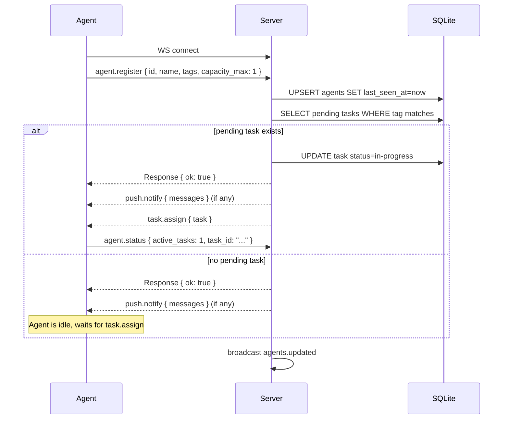
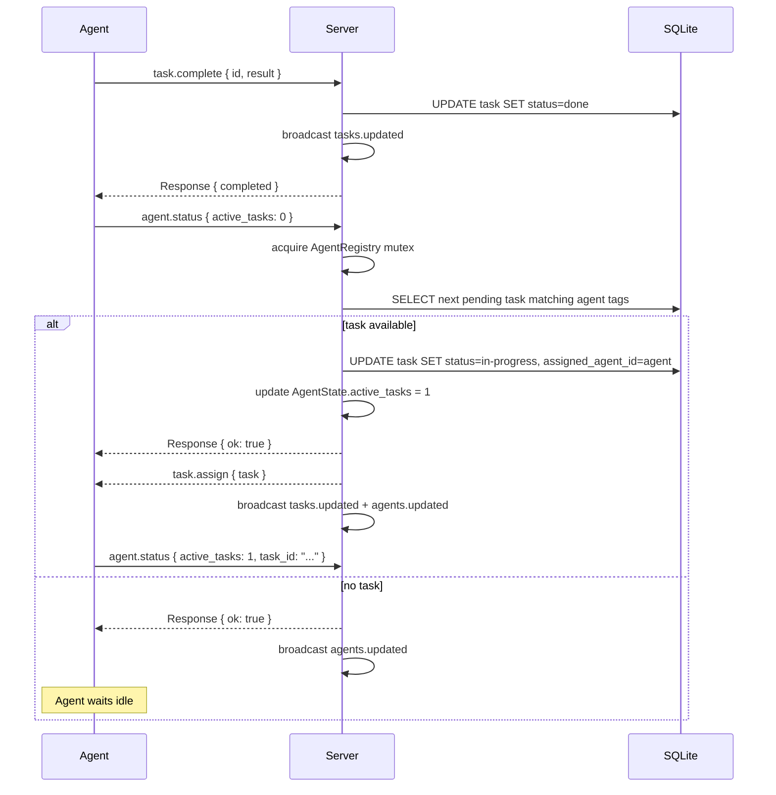
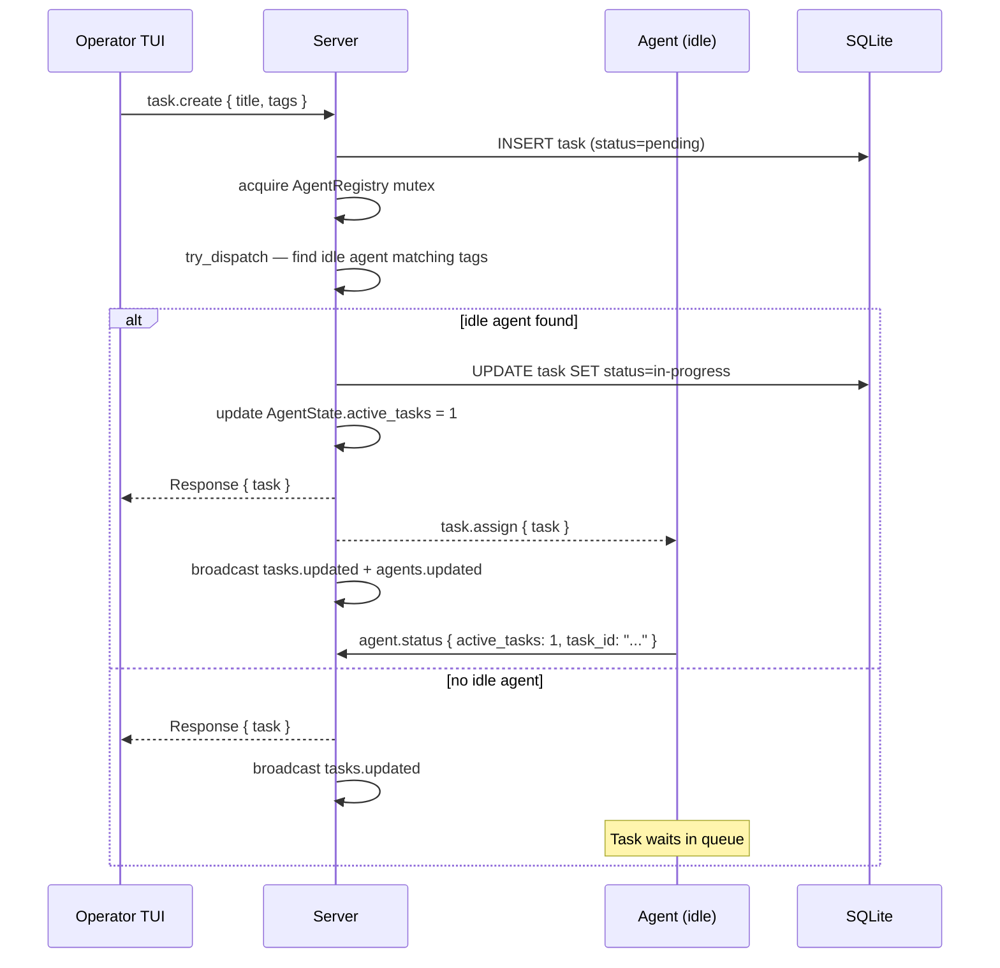
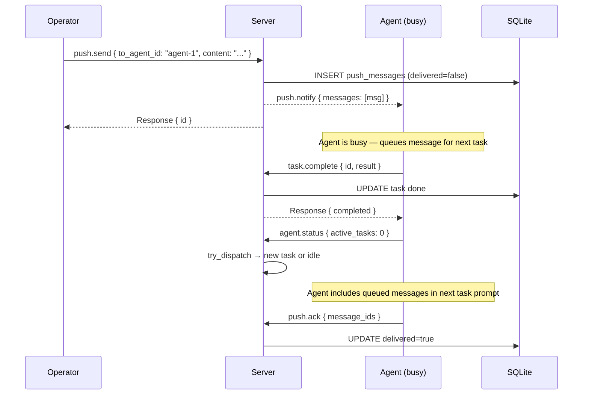
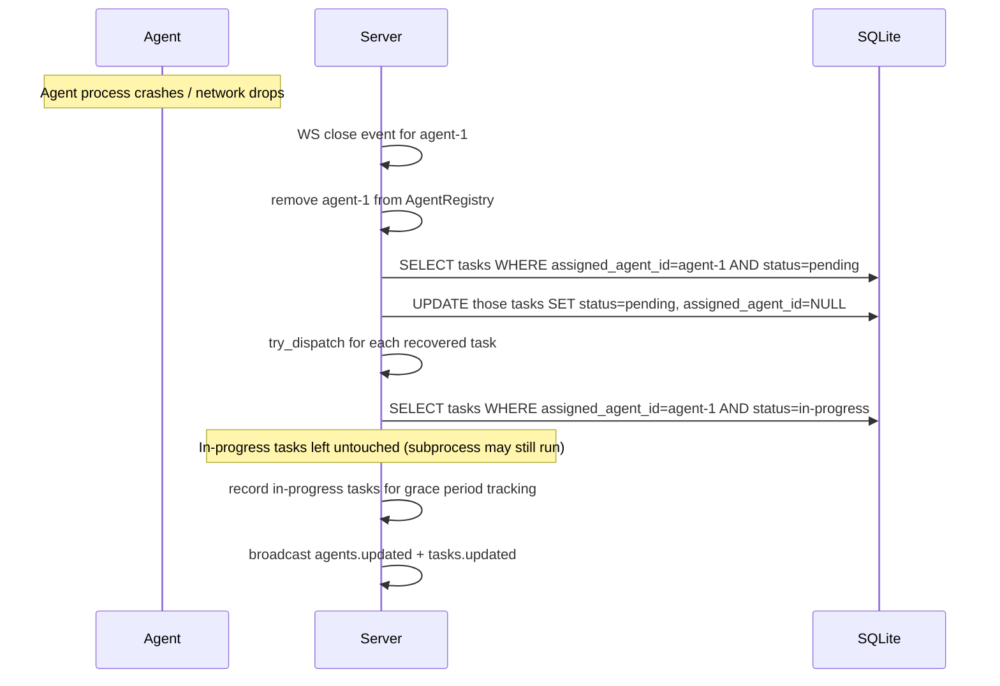
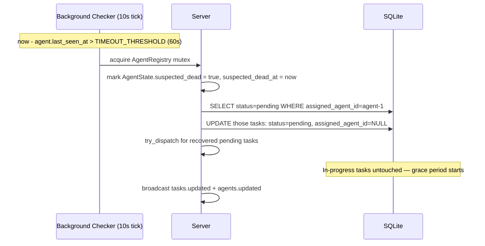
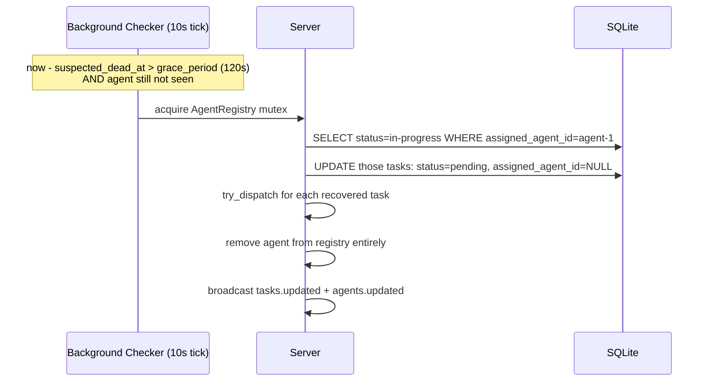
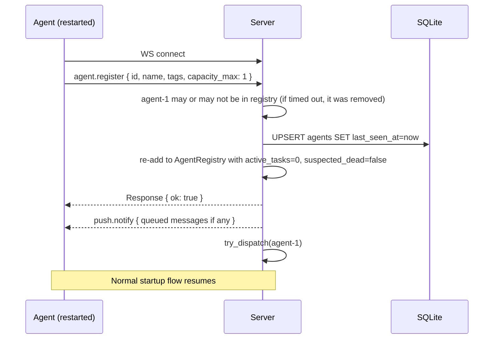

# Agent-Server Communication Protocol v2: State-Change-Driven Design

## Rationale

### Why replace the polling model?

The current model has agents poll `task.get_next` every 5 seconds. This has several fundamental problems:

- **5s assignment latency** — even if a task is ready and an agent is idle, assignment is delayed up to 5 seconds
- **Push messages blocked during tasks** — the polling loop only checks push messages when idle; during a long task, push messages pile up indefinitely
- **No server-side state** — the server has no record of whether an agent is busy or idle; it cannot proactively assign work
- **Stuck `InProgress` tasks** — if an agent crashes mid-task, no recovery mechanism exists
- **Polling overhead** — every agent fires an RPC every 5 seconds regardless of system activity

### Why state-change-driven?

When an agent changes state (starts a task, finishes a task, boots up), it tells the server immediately. This gives the server accurate real-time state at zero polling cost. The server can then dispatch work optimally: the moment an agent goes idle and a matching task exists, or the moment a task is created and a matching idle agent exists, work is assigned in milliseconds.

### Why server-side assignment?

Pull-based assignment (agent asks "give me work") requires polling intervals. Push-based assignment (server says "do this") enables zero-latency dispatch. The server has global state — it can match tasks to agents optimally. Agents don't need to know anything about the task queue.

### Why capacity threshold, not binary busy/idle?

`active_tasks < capacity_max` generalizes cleanly. Currently all agents run `capacity_max=1`, making it effectively binary. But future use cases (lightweight status tasks, parallel subtask execution) can raise the threshold without protocol changes.

---

## Answers to Design Questions

### Q1: Should `task.assign` be fire-and-forget or request-response?

**Answer: fire-and-forget push with implicit rejection via reconnect.**

`task.assign` is a server→agent push (type: `push`). The agent does not send a `task.accept` response. If the agent is momentarily unavailable when the push arrives:
- If the WS connection is open but the agent is briefly unresponsive: the server's outbound channel buffers the message. When the agent processes it, it sends `agent.status { active_tasks: 1 }` back.
- If the WS connection drops between dispatch and delivery: the server immediately recovers dispatched-but-not-started tasks on disconnect (see Q7). No task is ever lost.

Rationale: acknowledgements add round-trip overhead. Since the server already tracks `last_seen_at` and has a disconnect handler, missing ACKs are caught structurally rather than per-message.

### Q2: How does the server avoid double-assignment?

**Answer: a single Mutex guards `try_dispatch`.**

The `AgentRegistry` (see below) is wrapped in a `Mutex<AgentRegistry>`. All calls to `try_dispatch` — whether triggered by `agent.status`, `task.create`, or any other path — acquire this mutex before reading agent state and selecting a task. The critical section is: read ready agents → pick first match → update `agent.active_tasks` in registry → send `task.assign`. This is held briefly (SQLite read + in-memory write + send) and is the only place assignments happen.

### Q3: What happens to `PendingRequests` oneshot map?

**Answer: retained but scoped to the remaining RPCs.**

The polling loop is eliminated, removing `task.get_next`. However several request-response RPCs remain:
- `push.list` / `push.ack` — agents still fetch push messages (now triggered by `push.notify` or at task start, not on a poll timer)
- `task.complete` — still a request with response (server confirms and returns next metadata)
- `topic.*` — MCP server makes these on behalf of coding agents

`PendingRequests` stays. It is already correct and handles all remaining RPCs.

### Q4: Should push.list/push.ack stay as RPCs or become push-driven?

**Answer: push-driven delivery, ACK retained.**

Add a new server→agent push: `push.notify { messages: PushMessage[] }`. The server sends this when:
- A new push message arrives for the agent (`push.send` handler)
- The agent connects/reconnects (server delivers any queued messages immediately on `agent.register`)

The agent no longer needs to poll `push.list`. It processes `push.notify` messages and sends `push.ack { message_ids }`. `push.list` is kept as a fallback RPC (agents can call it to re-sync, e.g. after reconnect where the notify may have been missed).

### Q5: What is the right WATCHDOG_INTERVAL?

**Answer: `WATCHDOG_INTERVAL = 30s`, `TIMEOUT_THRESHOLD = 60s`, `grace_period = 120s`.**

See Q8 for full justification. The key invariant:
```
WATCHDOG_INTERVAL (30s) < TIMEOUT_THRESHOLD (60s) < TIMEOUT_THRESHOLD + grace (180s total)
```

### Q6: Should `agent.status` be separate from `agent.heartbeat`?

**Answer: `agent.status` for state changes, `agent.heartbeat` only for liveness (no business state).**

These serve different purposes:
- `agent.status` carries business data (`active_tasks`, `task_id`) and triggers dispatch logic
- `agent.heartbeat` only proves the connection is alive; it carries no data and triggers no dispatch

Merging them would mean the server runs dispatch logic on every heartbeat, even when nothing changed. Keeping them separate is cleaner and cheaper.

### Q7: Agent timeout and task recovery

**Two-stage recovery with a grace period for in-progress tasks:**

#### Stage 1 — Timeout fires (agent silent > TIMEOUT_THRESHOLD)
The server background checker runs every 10 seconds. For each registered agent:
- If `now - last_seen_at > TIMEOUT_THRESHOLD` AND agent not already `suspected_dead`:
  - Mark agent as `suspected_dead` (in-memory flag in `AgentState`)
  - **Dispatched-but-not-started tasks** (`assigned_agent_id = agent_id`, `status = pending`): immediately reset to `pending` with `assigned_agent_id = NULL`. Call `try_dispatch` for each recovered task.
  - **In-progress tasks** (`assigned_agent_id = agent_id`, `status = in-progress`): leave untouched. Record `suspected_dead_at = now`. The coding subprocess may still be running.

#### Stage 2 — Grace period expires (agent still silent > TIMEOUT_THRESHOLD + grace_period)
- **In-progress tasks**: reset to `pending` with `assigned_agent_id = NULL`. Call `try_dispatch`.

The reset-to-`pending` status is used (not a new `interrupted` status) because:
- Keeps the state machine simple (no new status to handle everywhere)
- Agents are idempotent by design — re-running a task should produce the same result

If the task has side effects that make re-running dangerous, the operator can review the task queue. A future enhancement could add an `interrupted` status, but it is out of scope here.

`try_dispatch` is called immediately after re-queuing so recovered tasks are assigned without waiting for the next agent event.

### Q8: Concrete timeout values and justification

| Value | Setting | Justification |
|---|---|---|
| `WATCHDOG_INTERVAL` | 30s | Agent sends a heartbeat if no state-change in 30s. In a busy system, `agent.status` messages flow frequently enough that heartbeats are rare. |
| `TIMEOUT_THRESHOLD` | 60s | If the server hasn't heard from an agent in 60s (two watchdog intervals + margin), the agent is likely dead or unreachable. Allows one missed heartbeat before flagging. |
| `grace_period` | 120s | In-progress tasks get 2 minutes of grace. A coding agent subprocess (kilo/claude) may take minutes; we don't want to interrupt a running task unless the agent is genuinely dead. 2 minutes is generous but bounded. |

**Invariant explicitly stated:**
```
30s = WATCHDOG_INTERVAL
60s = TIMEOUT_THRESHOLD          (WATCHDOG_INTERVAL < TIMEOUT_THRESHOLD ✓)
180s = TIMEOUT_THRESHOLD + grace (TIMEOUT_THRESHOLD < TIMEOUT_THRESHOLD + grace ✓)
```

---

## Complete Message Specification

### Agent → Server Messages

#### `agent.register`
Direction: Agent → Server
When: immediately on WebSocket connect
```json
{
  "type": "request",
  "id": "<uuid>",
  "method": "agent.register",
  "params": {
    "id": "agent-1",
    "name": "Agent 1",
    "tags": ["backend"],
    "capacity_max": 1
  }
}
```
Server behavior:
- Upsert agent row in DB (`last_seen_at = now`, `capacity_max = capacity_max`)
- Update `AgentRegistry`: add/update `AgentState` with `active_tasks = 0`, `capacity_max = N`
- Deliver any queued push messages immediately via `push.notify`
- Call `try_dispatch(agent_id)` — assign a pending task if one matches
- Respond: `{ "ok": true }`
- Broadcast `agents.updated`

#### `agent.status`
Direction: Agent → Server
When: every state change (task started, task completed, agent boot)
```json
{
  "type": "request",
  "id": "<uuid>",
  "method": "agent.status",
  "params": {
    "active_tasks": 1,
    "task_id": "abc123"
  }
}
```
or on idle:
```json
{
  "type": "request",
  "id": "<uuid>",
  "method": "agent.status",
  "params": {
    "active_tasks": 0
  }
}
```
Server behavior:
- Update `AgentState.active_tasks` in registry
- Update `last_seen_at` in DB
- If `active_tasks < capacity_max`: call `try_dispatch(agent_id)` — assign a pending task if available
- Respond: `{ "ok": true }`
- Broadcast `agents.updated`

#### `agent.heartbeat`
Direction: Agent → Server
When: only if no other message sent in the past `WATCHDOG_INTERVAL` (30s)
```json
{
  "type": "request",
  "id": "<uuid>",
  "method": "agent.heartbeat",
  "params": {}
}
```
Server behavior:
- Update `last_seen_at` in DB and `AgentState.last_seen_at`
- Clear `suspected_dead` flag if set
- Respond: `{ "ok": true }`

#### `task.complete`
Direction: Agent → Server
When: coding agent subprocess exits
```json
{
  "type": "request",
  "id": "<uuid>",
  "method": "task.complete",
  "params": {
    "id": "task-uuid",
    "result": "output string..."
  }
}
```
Server behavior:
- Mark task `done` in DB
- Broadcast `tasks.updated`
- Respond: `{ "completed": "task-uuid" }`
- Note: server does NOT include `next_task` — next assignment arrives via `task.assign` when agent sends `agent.status { active_tasks: 0 }`

#### `push.ack`
Direction: Agent → Server
Unchanged from v1.
```json
{
  "type": "request",
  "id": "<uuid>",
  "method": "push.ack",
  "params": { "message_ids": ["msg-1", "msg-2"] }
}
```
Server behavior: mark messages `delivered = true` in DB. Respond: `{ "ok": true, "acked": N }`.

#### `push.list` (retained as fallback)
Direction: Agent → Server
Unchanged from v1. Used for re-sync after reconnect.

---

### Server → Agent Messages

#### `task.assign`
Direction: Server → Agent
Type: `push` (no response expected)
```json
{
  "type": "push",
  "id": "<uuid>",
  "method": "task.assign",
  "params": {
    "task": {
      "id": "task-uuid",
      "title": "...",
      "description": "...",
      "tags": [],
      "status": "in-progress",
      "assigned_agent_id": "agent-1"
    }
  }
}
```
Agent behavior:
- Immediately begin execution: fetch push messages (if `push.notify` not already received), call `executor::run(task)`
- Send `agent.status { active_tasks: 1, task_id: "task-uuid" }`

#### `push.notify`
Direction: Server → Agent
Type: `push` (no response expected)
```json
{
  "type": "push",
  "id": "<uuid>",
  "method": "push.notify",
  "params": {
    "messages": [
      {
        "id": "msg-uuid",
        "from_agent_id": "agent-2",
        "to_agent_id": "agent-1",
        "content": "...",
        "delivered": false,
        "created_at": "..."
      }
    ]
  }
}
```
Agent behavior:
- If idle (no active task): call `executor::run_push_only(messages)`, then `push.ack`
- If busy (active task): queue messages; include in next task's prompt and ack after

#### `tasks.updated`, `agents.updated`, `topics.updated`
Unchanged from v1 — broadcast to all clients on state changes.

---

## AgentState Server Data Structure

```rust
/// In-memory state for a connected agent, stored in AgentRegistry.
pub struct AgentState {
    /// Agent ID (matches DB agents.id)
    pub id: String,
    /// Agent tags (for task matching)
    pub tags: Vec<String>,
    /// Currently active task count (reported by agent)
    pub active_tasks: u8,
    /// Maximum concurrent tasks this agent can run
    pub capacity_max: u8,
    /// Outbound WS channel for sending messages to this agent
    pub ws_sender: UnboundedSender<Message>,
    /// Timestamp of last received message (updated on every message)
    pub last_seen_at: DateTime<Utc>,
    /// Set when last_seen_at exceeds TIMEOUT_THRESHOLD; cleared on any message
    pub suspected_dead: bool,
    /// When suspected_dead was set (used for grace period calculation)
    pub suspected_dead_at: Option<DateTime<Utc>>,
}

/// Thread-safe registry of all connected agents.
pub type AgentRegistry = Arc<Mutex<HashMap<String, AgentState>>>;
```

Key operation:
```rust
/// Find the first ready agent matching the given tag and assign a task.
/// Returns true if assignment was made.
fn try_dispatch(registry: &mut AgentRegistry, db: &DbPool, tag: Option<&str>) -> bool {
    // 1. Find ready agents (active_tasks < capacity_max, matching tag)
    // 2. Pick first (FIFO — simplest fair policy)
    // 3. Get next pending task from DB matching tag
    // 4. Update task status to in-progress, assigned_agent_id in DB
    // 5. Update AgentState.active_tasks += 1
    // 6. Send task.assign push to agent
    // 7. Broadcast tasks.updated
}
```

---

## Sequence Diagrams

### Agent Startup and Initial Task Assignment



### Task Assigned on Agent Idle (agent sends status after completing a task)



### Task Assigned on Task Creation (new task, idle agent waiting)



### Push Message Received While Agent Busy



### Agent WebSocket Disconnect — Immediate Task Recovery



### Agent Timeout — Stage 1: suspected_dead



### Agent Timeout — Stage 2: Grace Period Expired



### Agent Reconnect After Timeout



---

## Follow-on Implementation Tasks

The following tasks are required to implement this design. Each is self-contained and can be tracked independently.

### Task A: Add `AgentState` in-memory registry to hive-server

- Define `AgentState` struct in new `crates/hive-server/src/agent_registry.rs`
- `AgentRegistry = Arc<Mutex<HashMap<String, AgentState>>>`
- Move per-connection WS sender from `state.clients` into `AgentState`
- Update `AppState` to use `AgentRegistry` instead of `clients`
- Compatibility: `send_to` helper updated to look up via registry
- All existing tests must pass

### Task B: Implement `try_dispatch` in hive-server

- In `agent_registry.rs`, implement `try_dispatch(registry, db, agent_id) -> bool`
- Picks the tagged pending task with lowest position; claims it atomically
- Sends `task.assign` push to agent via `AgentState.ws_sender`
- Call from: `agent.register` handler, `agent.status` handler (on idle), `task.create` handler, `task.split` handler (for each new subtask), disconnect recovery

### Task C: Add `agent.status` WS handler in hive-server

- New handler in `handlers/agents.rs`: `status(registry, db, agent_id, params)`
- Updates `AgentState.active_tasks` and `last_seen_at`
- Calls `try_dispatch` if `active_tasks < capacity_max`
- Broadcasts `agents.updated`

### Task D: Add `push.notify` — push delivery on `push.send`

- In `handlers/push.rs` `send()`: after inserting to DB, look up agent in registry and push `push.notify { messages: [msg] }`
- In `agent.register` handler: fetch all undelivered messages for the agent and send `push.notify` if any

### Task E: Add background timeout checker in hive-server

- `tokio::spawn` a loop that ticks every 10 seconds
- Stage 1: for agents where `last_seen_at > TIMEOUT_THRESHOLD` and `!suspected_dead`: recover pending tasks, set flag
- Stage 2: for agents where `suspected_dead` and `now - suspected_dead_at > grace_period`: recover in-progress tasks, remove from registry

### Task F: Update hive-agent to send `agent.status`

- Remove `polling::run` loop (no more `task.get_next` polling)
- After `agent.register`: send `agent.status { active_tasks: 0 }`
- In `agent.rs` `spawn_task`: at start, send `agent.status { active_tasks: 1, task_id }`; at end, send `agent.status { active_tasks: 0 }`
- Handle `task.assign` push in the main push consumer loop: extract task, call `spawn_task`

### Task G: Update hive-agent to handle `push.notify` and watchdog heartbeat

- In push consumer loop: handle `push.notify` — queue messages for next task or execute immediately if idle
- Implement watchdog timer: if `now - last_message_sent > WATCHDOG_INTERVAL`, send `agent.heartbeat`
- Remove `handle_idle_push_messages` (replaced by `push.notify`)

### Task H: Update `task.complete` response (remove `next_task`)

- Server: remove `next_task` from `task.complete` response (next assignment now via `task.assign`)
- Agent: update `spawn_task` to not expect `next_task` in response

### Task I: End-to-end integration test

- Test: register agent → create task → verify `task.assign` received by agent within 100ms
- Test: agent completes task → agent sends `status { active_tasks: 0 }` → new task assigned immediately
- Test: disconnect recovery — disconnect mid-task → reconnect → verify task reassigned
- Test: timeout stage 1 and stage 2 (using short test values)
