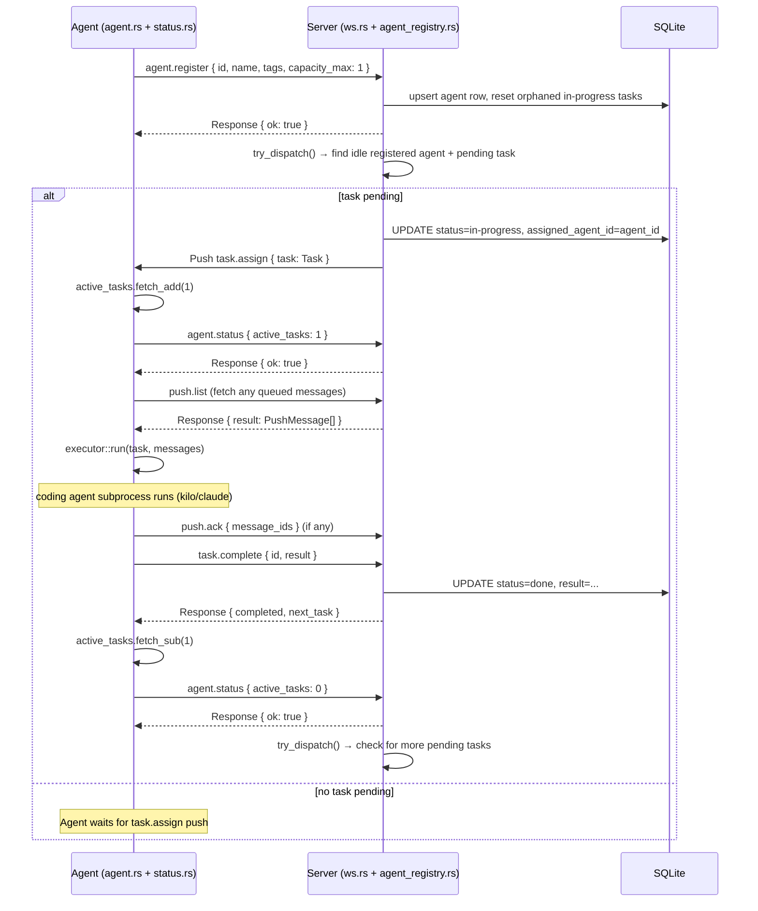
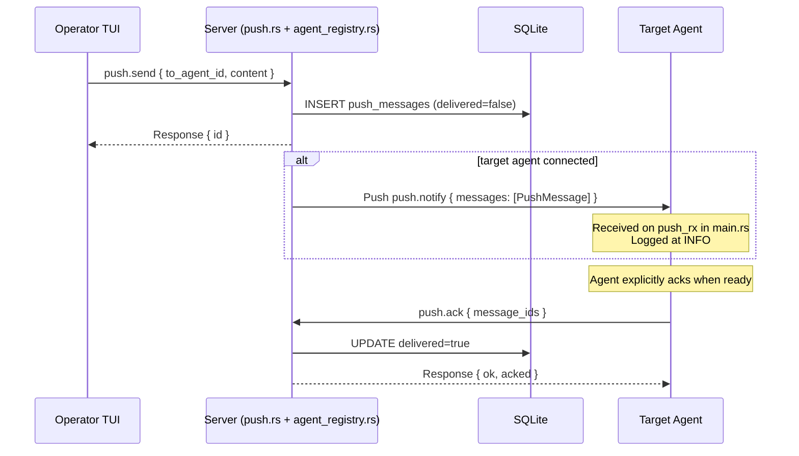

# Agent-Server Communication Architecture

## Overview

Agents connect to the server via a persistent WebSocket. All communication is structured as `ApiMessage` envelopes. The protocol is **state-change-driven**: agents declare their state (`agent.register`, `agent.status`), and the server proactively dispatches tasks via `task.assign` pushes when capacity is available. Agents no longer poll for tasks.

---

## ApiMessage Wire Format

Every message — request, response, error, or push — uses the same JSON envelope:

```json
{
  "type": "request" | "response" | "error" | "push",
  "id": "<uuid>",
  "method": "<method-name>",   // present on requests and pushes
  "params": { ... },           // present on requests and pushes
  "result": { ... },           // present on responses
  "error": { "code": N, "message": "..." }  // present on error responses
}
```

---

## WebSocket Message Table

| Method | Direction | Params | Response / Push shape |
|---|---|---|---|
| `agent.register` | Agent → Server | `{ id, name, tags[], capacity_max }` | `{ ok: true, agent_id }` |
| `agent.status` | Agent → Server | `{ active_tasks }` | `{ ok: true }` |
| `agent.heartbeat` | Agent → Server | — | `{ ok: true }` |
| `agent.list` | Agent → Server | — | `Agent[]` |
| `task.get_next` | Agent → Server | `{ agent_id, tag? }` | `Task` or `null` (legacy) |
| `task.complete` | Agent → Server | `{ id, result? }` | `{ completed, next_task }` |
| `task.create` | Agent → Server | `{ title, description?, tags? }` | `Task` |
| `task.list` | Agent → Server | `{ status?, tag?, assigned_agent_id? }` | `Task[]` |
| `task.get` | Agent → Server | `{ id }` | `Task` |
| `task.update` | Agent → Server | `{ id, description?, tags?, status? }` | `Task` |
| `task.split` | Agent → Server | `{ id, subtasks[] }` | `Task[]` |
| `task.set_dependency` | Agent → Server | `{ task_id, depends_on_id }` | `{ ok: true }` |
| `push.send` | Agent → Server | `{ to_agent_id, content }` | `{ id }` |
| `push.list` | Agent → Server | — | `PushMessage[]` (undelivered) |
| `push.ack` | Agent → Server | `{ message_ids[] }` | `{ ok, acked }` |
| `topic.create` | Agent → Server | `{ title, content, creator_agent_id? }` | `Topic` |
| `topic.list` | Agent → Server | — | `Topic[]` |
| `topic.get` | Agent → Server | `{ id }` | `Topic + comments` |
| `topic.comment` | Agent → Server | `{ topic_id, content, creator_agent_id? }` | `Comment` |
| `task.assign` | Server → Agent | `{ task: Task }` | — (push, no response) |
| `push.notify` | Server → Agent | `{ messages: PushMessage[] }` | — (push, no response) |
| `tasks.updated` | Server → All | `Task[]` | — (push, no response) |
| `agents.updated` | Server → All | `Agent[]` | — (push, no response) |
| `topics.updated` | Server → All | `Topic[]` | — (push, no response) |

---

## Task Acquisition Flow (v2: state-change-driven)



---

## Push Message Flow (Agent-to-Agent)



---

## Watchdog Heartbeat

When the agent is idle (no tasks), the watchdog loop sends `agent.heartbeat` to keep `last_seen_at` current in the server DB:

```
loop every 10s:
    if time_since_last_status_report > 30s:
        send agent.heartbeat
        reset timer
```

`agent.status` messages (sent on state changes) also reset the timer, so in a busy system the watchdog never fires. In a quiet system it sends once per 30 seconds.

---

## Server-Side Agent State

The server maintains an **in-memory registry** (`AgentRegistry = Arc<Mutex<HashMap<String, AgentState>>>`) alongside the SQLite `agents` table:

```rust
struct AgentState {
    id: String,
    tags: Vec<String>,
    capacity_max: u8,          // from agent.register
    active_tasks: u8,          // updated by agent.status
    last_seen_at: DateTime<Utc>,
    ws_tx: UnboundedSender<Message>,
    registered: bool,          // true after agent.register processed
}
```

`try_dispatch` is the **only** place tasks move from `pending` to `in-progress`. It is called from three places:
1. `agent.register` handler — agent just became eligible
2. `agent.status` handler — agent may have freed capacity
3. Task creation (`task.create`, `task.split`) — new tasks available

`try_dispatch` holds the registry lock for the duration (including the DB claim) to prevent double-assignment.

The `registered` flag provides backward compatibility: agents that never send `agent.register` (using the old `task.get_next` polling protocol) are present in the registry but never receive proactive `task.assign` pushes.

---

## Task Lifecycle

```
Pending
  ↓ (try_dispatch: server claims, sends task.assign)
InProgress → assigned_agent_id set
  ↓ (task.complete: agent sends result)
Done
```

Operator can reset `InProgress → Pending` via `task.update { status: "pending" }` (clears `assigned_agent_id`). On agent disconnect, any `InProgress` tasks assigned to that agent are automatically reset to `Pending`.

---

## Known Failure Modes

| Failure | What happens |
|---|---|
| Agent crash mid-task | On reconnect, `agent.register` resets any orphaned `InProgress` tasks to `Pending`. Server re-dispatches them. |
| Push message while agent busy | Message stored in DB. Live-delivered via `push.notify` to agent's WS channel (logged). Agent acks when convenient. No processing delay on task pipeline. |
| Duplicate `agent_id` on reconnect | New connection replaces the old entry in the registry. Old WS send task is aborted. |
| `task.complete` while no next task | Agent sends `agent.status { active_tasks: 0 }`, server calls `try_dispatch`, finds nothing. Agent waits for future `task.assign`. |
| Multiple agents, one task | `try_dispatch` holds the registry + DB lock atomically. Only one agent claims the task. |
| Server restart while agent busy | Agent reconnects; on `agent.register`, orphaned `InProgress` tasks are reset to `Pending` and re-dispatched. |
