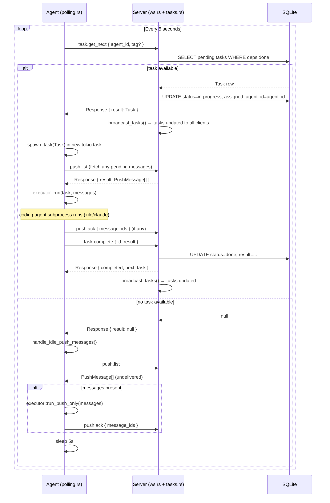
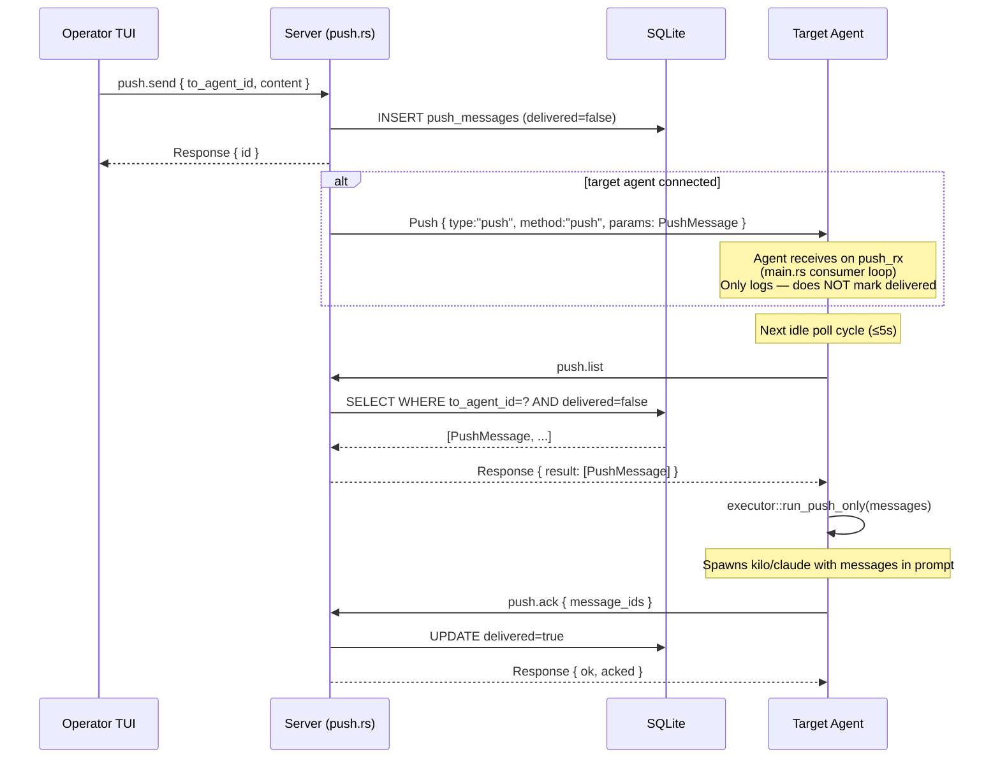

# Agent-Server Communication Architecture

## Overview

Agents connect to the server via a persistent WebSocket. All communication is structured as `ApiMessage` envelopes. Agents drive the protocol entirely — they poll for tasks, execute them, and complete them. The server is passive: it only reacts to requests and broadcasts state changes to all connected clients.

---

## ApiMessage Wire Format

Every message — request, response, error, or push — uses the same JSON envelope:

```json
{
  "type": "request" | "response" | "error" | "push",
  "id": "<uuid>",
  "method": "<method-name>",   // present on requests and pushes
  "params": { ... },           // present on requests and pushes
  "result": { ... },           // present on responses
  "error": { "code": N, "message": "..." }  // present on error responses
}
```

---

## WebSocket Message Table

| Method | Direction | Params | Response shape |
|---|---|---|---|
| `agent.register` | Agent → Server | `{ id, name, tags[] }` | `{ ok: true }` |
| `agent.heartbeat` | Agent → Server | — | `{ ok: true }` |
| `agent.list` | Agent → Server | — | `Agent[]` |
| `task.get_next` | Agent → Server | `{ agent_id, tag? }` | `Task` or `null` |
| `task.complete` | Agent → Server | `{ id, result? }` | `{ completed, next_task }` |
| `task.create` | Agent → Server | `{ title, description?, tags? }` | `Task` |
| `task.list` | Agent → Server | `{ status?, tag?, assigned_agent_id? }` | `Task[]` |
| `task.get` | Agent → Server | `{ id }` | `Task` |
| `task.update` | Agent → Server | `{ id, description?, tags?, status? }` | `Task` |
| `task.split` | Agent → Server | `{ id, subtasks[] }` | `Task[]` |
| `task.set_dependency` | Agent → Server | `{ task_id, depends_on_id }` | `{ ok: true }` |
| `push.send` | Agent → Server | `{ to_agent_id, content }` | `{ id }` |
| `push.list` | Agent → Server | — | `PushMessage[]` (undelivered) |
| `push.ack` | Agent → Server | `{ message_ids[] }` | `{ ok, acked }` |
| `topic.create` | Agent → Server | `{ title, content, creator_agent_id? }` | `Topic` |
| `topic.list` | Agent → Server | — | `Topic[]` |
| `topic.get` | Agent → Server | `{ id }` | `Topic + comments` |
| `topic.comment` | Agent → Server | `{ topic_id, content, creator_agent_id? }` | `Comment` |
| `tasks.updated` | Server → All | `Task[]` | — (push, no response) |
| `agents.updated` | Server → All | `Agent[]` | — (push, no response) |
| `topics.updated` | Server → All | `Topic[]` | — (push, no response) |
| `push` (live delivery) | Server → Agent | `PushMessage` | — (push, no response) |

---

## Task Acquisition Flow



---

## Push Message Flow (Agent-to-Agent)



---

## Server-Side Agent State

The server tracks agents in the SQLite `agents` table (via `communication.rs`). There is **no in-memory busy/idle state** — the server cannot proactively assign tasks to agents.

- `agent.register` → upserts a row with `connected_at = now`, `last_seen_at = now`
- `agent.heartbeat` → updates `last_seen_at = now` (sent every 30 seconds)
- On disconnect → `touch_agent()` updates `last_seen_at` so staleness can be detected

The TUI derives busy/idle state by cross-referencing `agents` with `tasks` (looking for `InProgress` tasks with `assigned_agent_id` matching an agent).

The server's `clients` map (`Arc<Mutex<HashMap<String, UnboundedSender<Message>>>>`) is the live connection registry. A key present in this map means the agent has an active WebSocket.

---

## Answers to Investigation Questions

### 1. Task lifecycle (summarized)

`Pending` → (claimed by `task.get_next`) → `InProgress` → (completed by `task.complete`) → `Done`

Operator can reset via `task.update { status: "pending" }` which also clears `assigned_agent_id`.

### 2. Push message lifecycle (summarized)

Created via `push.send` → stored with `delivered=false` → optionally live-delivered to agent WS (not marked delivered) → fetched by `push.list` on next idle poll → processed by coding agent → acknowledged via `push.ack` → marked `delivered=true` in DB.

### 3. How server tracks connected/idle/busy agents

No idle/busy in-memory state. Connected = key in `clients` map. Idle vs busy = derived from task state in DB (no `InProgress` task with that `assigned_agent_id` → idle).

### 4. Agent reconnects mid-task

The polling loop reconnects via `run_loop` with exponential backoff. Any task that was `InProgress` will remain `InProgress` in the DB — the agent re-registers but does not resume the task automatically. The task stays stuck at `InProgress` until either the operator resets it or the agent crashes and the operator intervenes. There is no automatic reset on reconnect (`reset_in_progress_for_agent` exists but is never called on reconnect — it would need to be called on `agent.register`).

### 5. Polling interval

5 seconds (`POLL_INTERVAL = Duration::from_secs(5)` in `polling.rs`). This was chosen as a reasonable balance between responsiveness and load. No adaptive mechanism — the interval is fixed regardless of task queue depth.

### 6. `tasks.updated` broadcast emission and consumers

Emitted by `broadcast_tasks()` in `ws.rs` after any successful `task.create`, `task.update`, `task.complete`, `task.split`, `task.set_dependency`, or `task.get_next` (only when a task was actually claimed, not on null results). Sent to all entries in the `clients` map.

Consumers:
- **hive-cli TUI** (`poller.rs`): updates `AppState.tasks` on receiving `tasks.updated`
- **hive-agent** (`main.rs`): logs at DEBUG and discards — agents do not use the broadcast

### 7. Known failure modes

| Failure | What happens |
|---|---|
| Push message while agent is busy | Message stored in DB, not processed until agent becomes idle. Delay unbounded (proportional to task duration). |
| Agent crash mid-task | Task stuck at `InProgress` forever. No watchdog, no timeout. Operator must reset manually. |
| Duplicate `agent_id` on reconnect | New connection replaces the old one in `clients` map. Old connection's send task may get orphaned briefly. |
| `task.get_next` returns null | Fixed: null is handled as "no task" case. Prior to fix: the response error path timed out after 30s, blocking the loop. |
| Push message live delivery fails | Delivery is best-effort and not marked delivered. The message will be fetched on the next `push.list` poll (≤5s). No message loss. |
| Server restart while agent busy | Agent reconnects; task remains `InProgress` in DB (SQLite persists). Agent does not re-execute. Same as crash scenario. |
| Multiple agents claiming same task | Prevented at DB level: `get_next` updates the row inside the same lock acquisition. SQLite serializes writes. |

### 8. Null result from `task.get_next`

The server returns `serde_json::json!(null)` when no task is available (`get_next` returns `None`). In Rust, this deserializes to `Option<Task>::None`. The polling loop checks:

```rust
Some(msg) if msg.error.is_none() && msg.result.as_ref().map_or(true, |v| v.is_null()) => {
    // No task — handle idle
}
```

The guard `map_or(true, ...)` handles both JSON `null` and missing `result` field. Prior to this fix, the null case fell through to the error branch, which triggered a 30-second timeout wait.

### 9. Coupling between polling and push handling

The polling loop runs sequentially: poll → handle push → sleep. This means:

- Push messages are only checked when idle (no task)
- A long-running task blocks push message processing indefinitely
- `send_request` in `push.list` uses the same 30-second timeout as task requests
- There is no concurrency between task execution and push checking — if a push arrives while a task is running, it waits until the task completes

This tight coupling is the primary motivation for tasks 265–270 (redesign to state-change-driven model).

---

## Known Issues Summary

1. **No server-side idle/busy state** — server cannot push tasks to agents; all scheduling is pull-only
2. **Fixed 5s polling latency** — 0–5s delay on task assignment, always
3. **Push messages blocked during task execution** — can be delayed indefinitely
4. **No crash/reconnect recovery** — stuck `InProgress` tasks require manual operator intervention
5. **No heartbeat timeout** — server never disconnects an agent that stopped sending heartbeats; TUI detects staleness visually but server takes no action
6. **No task result storage cleanup** — `result` field can be arbitrarily large; no size limit or TTL
