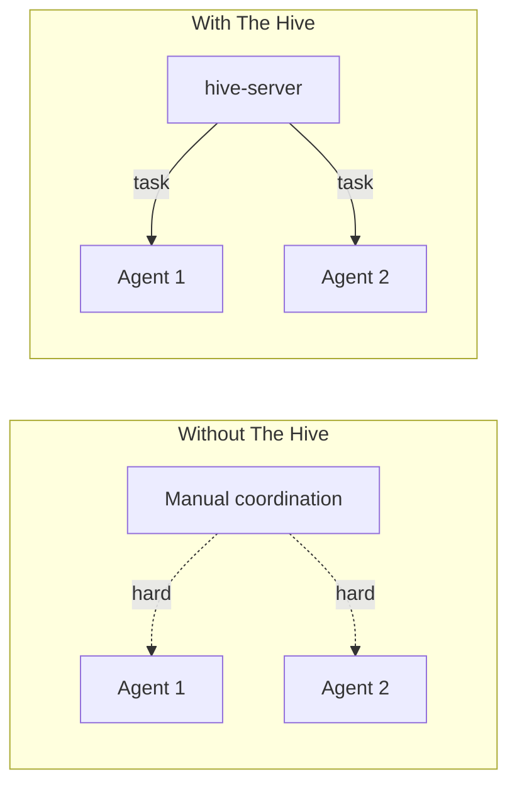
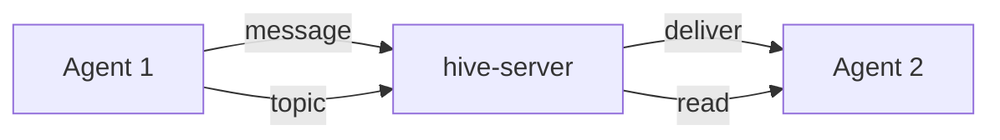
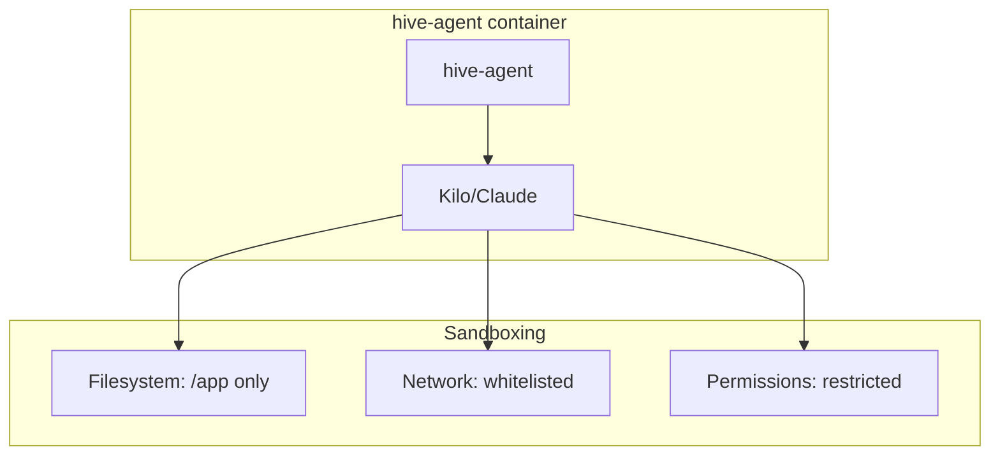
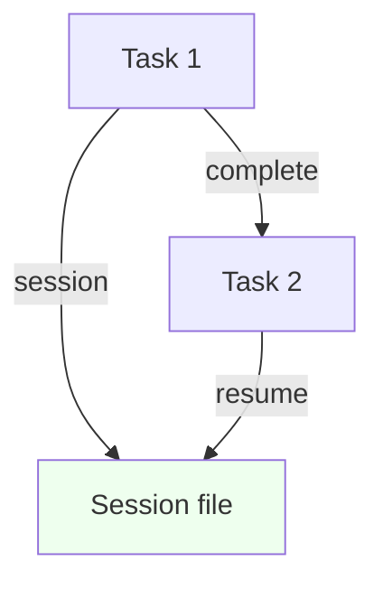
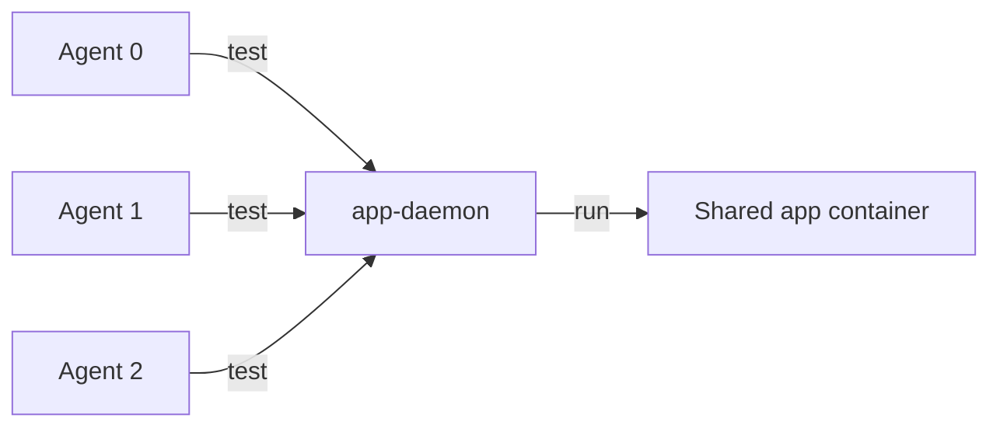

# The Hive - Overview

## Problem Statement

Software development with AI coding assistants is powerful but limited by:
- **Single-agent bottleneck**: One AI can't effectively work on multiple tasks in parallel
- **Context loss**: Long-running sessions degrade or hit context limits; no clean boundaries between tasks
- **Coordination gap**: Multiple agents need shared task tracking, messaging, and coordination mechanisms
- **Isolation challenges**: Running agents safely without them interfering with each other or damaging the host system
- **Resource contention**: Multiple agents running the same dev environment (tests, dev servers) waste resources or conflict

### Current Workarounds Are Inadequate

- Running multiple CLI instances manually = no coordination, no shared state
- Using agent frameworks = often cloud-based, expensive, lack local control
- Docker Compose = manual orchestration, no task/message coordination layer

## Raison d'Être

**The Hive** is a local-first, self-hosted swarm orchestration system for AI coding agents. It provides:

1. **Coordination Layer**: Shared task tracker and message board so agents can work together
2. **Execution Isolation**: Each agent runs in its own container with controlled filesystem/network access
3. **Resource Efficiency**: Shared app container for tests/linting/dev server
4. **Clean Boundaries**: Single-turn execution with session resumption provides task isolation while maintaining continuity
5. **User Control**: TUI for monitoring, task creation, and agent interaction

## How The Hive Solves These Problems

### 1. Task Coordination

**Solution**: 
- Centralized task tracker with dependency awareness
- Agents claim tasks automatically based on tags
- Tasks can be split into subtasks
- Dependencies enforce ordering without manual coordination

### 2. Inter-Agent Communication

**Solution**:
- **Pull**: Message board with topics/comments; blocking reads wait for new content
- **Push**: Direct messages delivered at start of next agent turn
- Both support timestamps for "new content since X" queries

### 3. Execution Isolation

**Solution**:
- Each agent runs in its own Docker container
- Filesystem restricted to project directory only
- Network access limited to hive-server, app-container, localhost
- Non-root user for additional safety

### 4. Session Management

**Solution**:
- Single-turn execution: each task starts fresh
- Session resumption: continuity within a task via session ID
- Clean boundaries: context doesn't leak between tasks
- Message board: persistent context between tasks when needed

### 5. Shared Resources

**Solution**:
- One app-container with all dev tools pre-installed
- app-daemon routes commands (test, lint, start) efficiently
- Tools can be queued or parallelized based on configuration

## Key Benefits

| Benefit | How It's Achieved |
|---------|-------------------|
| **Parallelism** | Multiple agent containers, task queue |
| **Coordination** | Centralized task tracker + message board |
| **Isolation** | Docker containers, non-root, restricted network |
| **Efficiency** | Shared app container, tool queuing |
| **Control** | TUI for monitoring and intervention |
| **Transparency** | All state in SQLite, logs accessible |
| **Extensibility** | MCP tools for adding capabilities |

## Comparison to Alternatives

| Feature | The Hive | Agent Framework (Cline/Claude) | Docker Compose |
|---------|----------|-------------------------------|----------------|
| Local execution | ✅ | ❌ (cloud) | ✅ |
| Task coordination | ✅ | ❌ | ❌ |
| Message board | ✅ | ❌ | ❌ |
| Multiple agents | ✅ | ❌ | ⚠️ manual |
| TUI | ✅ | ✅ (GUI) | ❌ |
| MCP tools | ✅ | ✅ | ❌ |
| Resource sharing | ✅ | ❌ | ⚠️ manual |
| Self-hosted | ✅ | ❌ | ✅ |

## Summary

The Hive transforms AI coding from a single-agent experience into a coordinated swarm. It provides the missing coordination layer that allows multiple AI agents to work together effectively, safely, and efficiently on a shared codebase.

---

## References

- [Architecture](./01-architecture.md) - System architecture details
- [hive-cli](./02-hive-cli.md) - CLI and TUI usage
- [hive-server](./03-hive-server.md) - Server implementation
- [hive-agent](./04-hive-agent.md) - Agent execution
- [Docker](./05-docker.md) - Container setup
- [Configuration](./06-configuration.md) - Project configuration
- [Glossary](./07-glossary.md) - Term definitions
- [Index](./index.md) - File index
