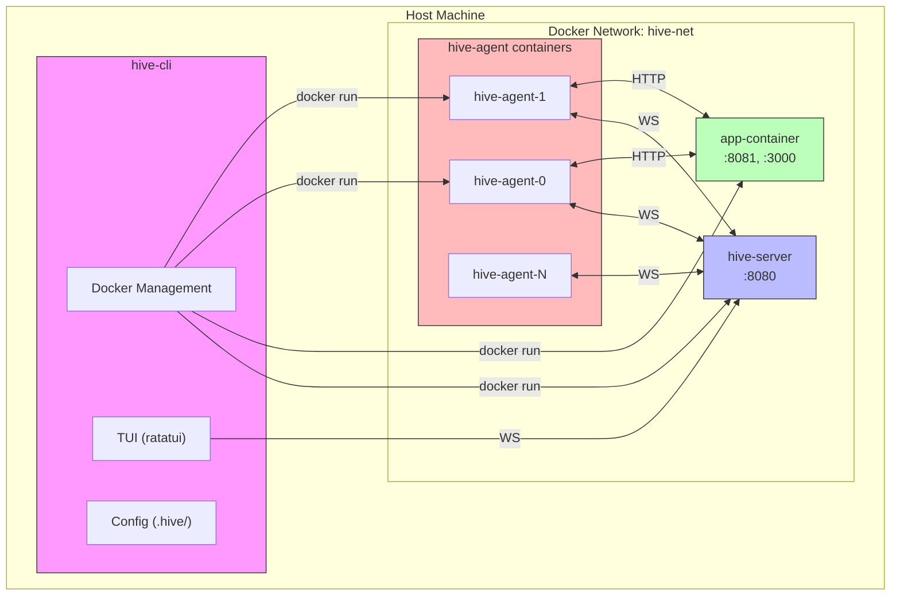
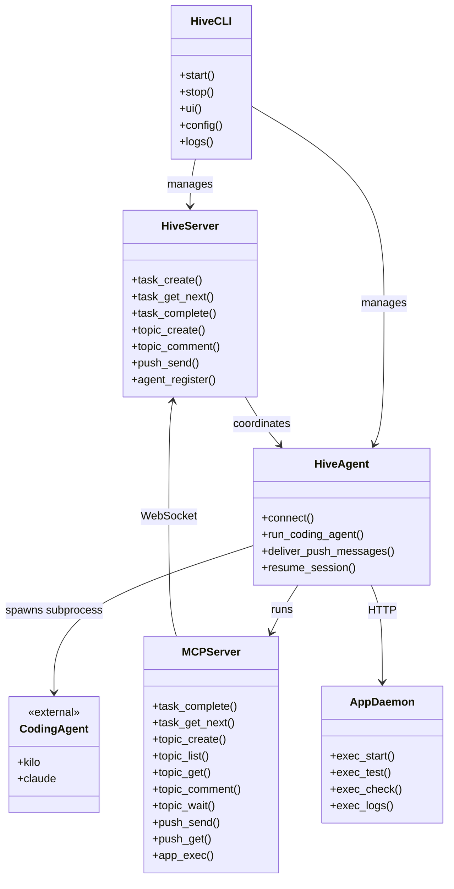
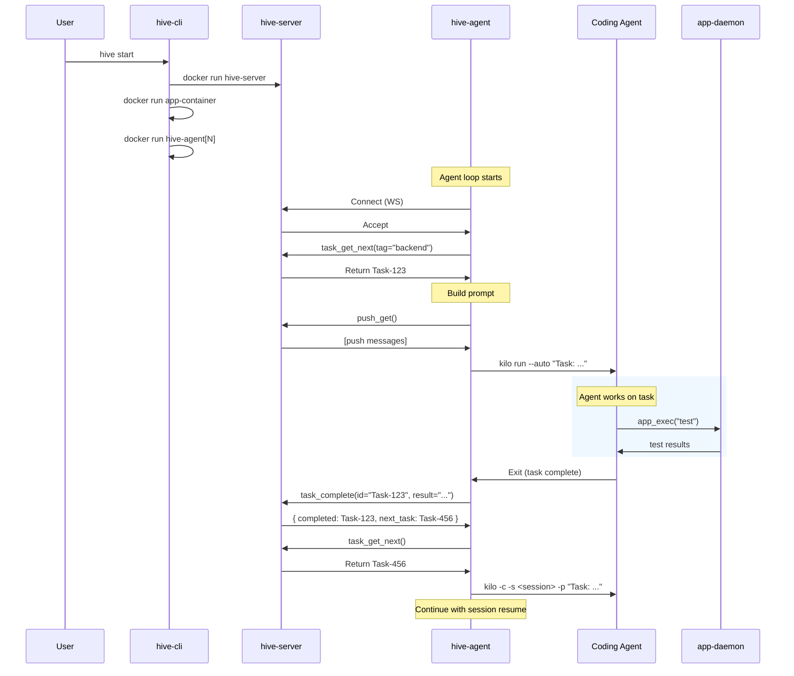
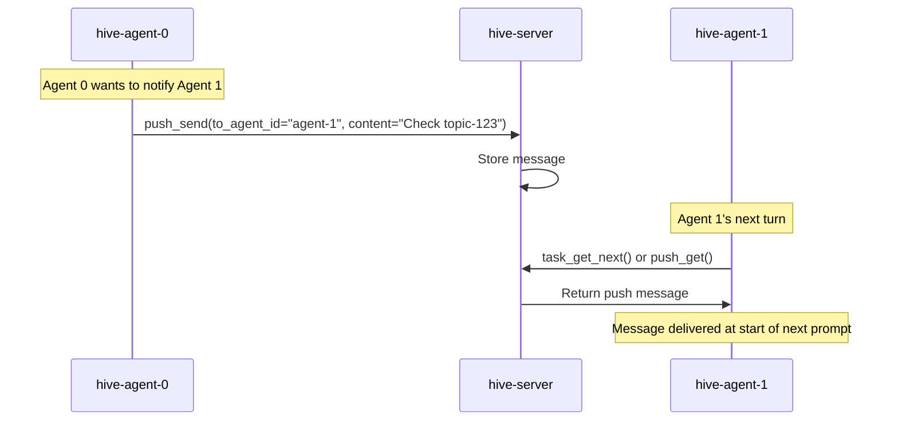
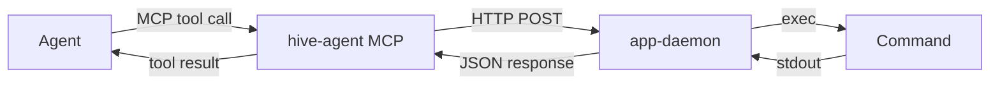
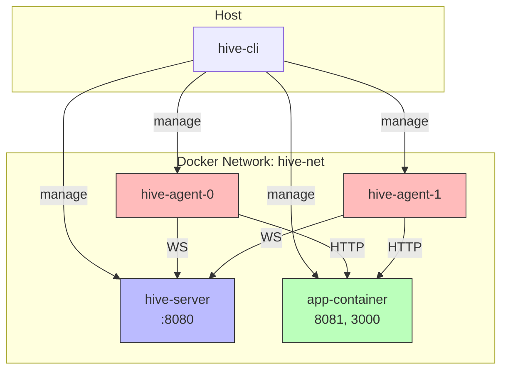
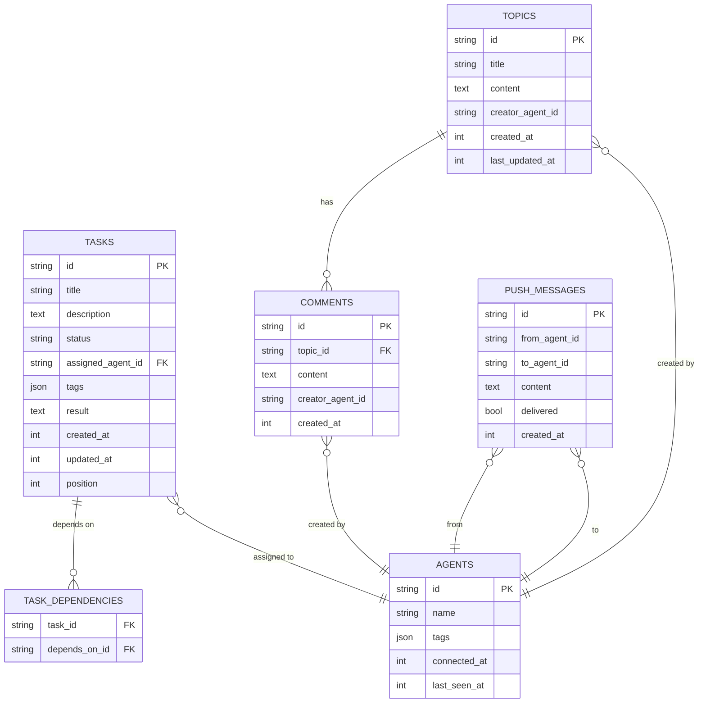
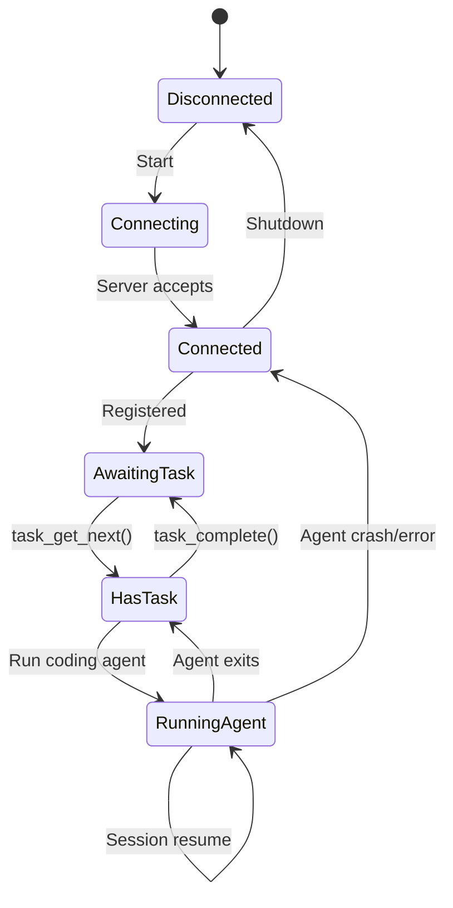

# The Hive - Architecture Specification

## Overview

The Hive is a swarm orchestration system for AI coding agents. It provides:
- A control plane (`hive-server`) for task coordination and inter-agent communication
- Agent containers (`hive-agent`) that execute coding agents (Claude Code, Kilo)
- A shared development environment (`app-container`) for running tests, linting, dev servers
- A CLI/TUI (`hive-cli`) for user interaction and container management

## System Architecture



### Component Diagram



## Components

### hive-cli

The user-facing CLI and TUI application.

**Responsibilities:**
- Parse CLI arguments (`start`, `stop`, `ui`, `connect`, `config`, etc.)
- Manage Docker containers (create, start, stop, remove)
- Provide TUI for monitoring and interaction
- Read/write `.hive/config.toml` and `.hive/hive.db`

**Directory structure in project:**
- Source: `hive-cli/`
- Binary: `hive` (installed)
- Config: `.hive/config.toml`
- Database: `.hive/hive.db`

### hive-server

The coordination control plane, runs in a Docker container.

**Responsibilities:**
- Task tracker (create, list, claim, update)
- Message board (topics, comments, blocking reads)
- Push message routing (inter-agent, user → agent)
- Agent registry (who is connected, their capabilities/tags)
- Persist all state to SQLite

**API:** WebSocket (preferred) or TCP for real-time communication with agents.

### hive-agent

The agent executor, runs in Docker container(s).

**Responsibilities:**
- Connect to hive-server (WS/TCP)
- Execute coding agent (Kilo, Claude Code) as subprocess
- Run MCP server exposing:
  - Task tracker commands (MCP tools)
  - Message board commands (MCP tools)
  - Push message send/receive
  - `app_exec` for interacting with app-container
- Manage session resumption (single-turn execution with `--continue`)
- Deliver push messages on next agent turn

**One container per agent.** Multiple agents = multiple containers.

### app-container

Shared development environment, runs in Docker.

**Responsibilities:**
- Run `app-daemon` (local service)
- Provide working directory with project code (`/app`)
- Pre-install tools: rust/cargo, node, pnpm, bun, tsc, pytest, etc.
- Isolated from `.hive/` directory (overlay mount)

**app-daemon:**
Listens on localhost (or Unix socket). Receives commands:
- `start` - Start dev server
- `restart` - Restart dev server  
- `stop` - Stop dev server
- `logs` - Get dev server logs
- `test [pattern]` - Run tests (optional filter)
- `check` - Run lint/type check

## Data Flow

### Task Workflow Sequence



### Inter-Agent Communication



### App Execution Flow



## Networking



**Restrictions:**
- Agents can reach: localhost, hive-server, app-container
- Agents blocked from: Internet (except whitelisted domains for web search)
- Filesystem: Agents can only write to `/app/` (project directory)

## Persistence

### ER Diagram



**SQLite Schema:**

```sql
-- Tasks
CREATE TABLE tasks (
    id TEXT PRIMARY KEY,
    title TEXT NOT NULL,
    description TEXT,
    status TEXT CHECK(status IN ('pending','in-progress','done','blocked','cancelled')) DEFAULT 'pending',
    assigned_agent_id TEXT,
    tags TEXT, -- JSON array
    created_at INTEGER NOT NULL,
    updated_at INTEGER NOT NULL,
    position INTEGER NOT NULL -- for ordering
);

-- Dependencies (edges in DAG)
CREATE TABLE task_dependencies (
    task_id TEXT REFERENCES tasks(id),
    depends_on_id TEXT REFERENCES tasks(id),
    PRIMARY KEY (task_id, depends_on_id)
);

-- Message Board Topics
CREATE TABLE topics (
    id TEXT PRIMARY KEY,
    title TEXT NOT NULL,
    content TEXT NOT NULL,
    creator_agent_id TEXT,
    created_at INTEGER NOT NULL,
    last_updated_at INTEGER NOT NULL
);

-- Message Board Comments
CREATE TABLE comments (
    id TEXT PRIMARY KEY,
    topic_id TEXT REFERENCES topics(id),
    content TEXT NOT NULL,
    creator_agent_id TEXT,
    created_at INTEGER NOT NULL
);

-- Push Messages
CREATE TABLE push_messages (
    id TEXT PRIMARY KEY,
    from_agent_id TEXT,
    to_agent_id TEXT NOT NULL,
    content TEXT NOT NULL,
    delivered BOOLEAN DEFAULT FALSE,
    created_at INTEGER NOT NULL
);

-- Agents
CREATE TABLE agents (
    id TEXT PRIMARY KEY,
    name TEXT NOT NULL,
    tags TEXT, -- JSON array, what this agent can do
    connected_at INTEGER,
    last_seen_at INTEGER
);

CREATE INDEX idx_tasks_status ON tasks(status);
CREATE INDEX idx_tasks_position ON tasks(position);
CREATE INDEX idx_comments_topic ON comments(topic_id);
CREATE INDEX idx_push_to_agent ON push_messages(to_agent_id, delivered);
```

## Execution Model: Single-Turn with Session Resumption

### State Machine



### Session Resumption Flow

```mermaid
flowchart TD
    A[Start new task] --> B{Session exists?}
    B -->|Yes| C[Resume with session ID]
    B -->|No| D[Start fresh]
    
    C --> E[Build prompt: task + push messages]
    D --> E
    
    E --> F[Run coding agent]
    F --> G[Capture session ID]
    G --> H[Save to /app/.hive/agents/{id}/session]
    H --> I[Agent exits]
    
    I --> J[task_complete]
    J --> K[Get next task]
    K --> L{New task?}
    L -->|Same task| M[Resume session]
    L -->|New task| N[Clear session]
    M --> C
    N --> D
```

Both Kilo and Claude Code support session continuation:

**Kilo:**
```bash
kilo run --auto "task description"  # Run once, exit when done
kilo -c -s <session-id>            # Resume session
```

**Claude Code:**
```bash
claude -p "task description"       # Run once, exit when done
claude -r <session-id> -p "..."    # Resume session with additional prompt
```

**hive-agent flow:**
1. Get task from server
2. Build prompt with task + push messages since last turn
3. Run coding agent (`kilo run --auto` or `claude -p`)
4. Capture session ID from output
5. Store session ID associated with task
6. On next turn for same task, resume with `-c -s <session-id>` plus new prompt
7. If new task, start fresh (no session to resume)

This provides:
- Clean task boundaries (each task = fresh context)
- Continuity within a task (session resumption)
- No complex session state to manage
- Simple subprocess lifecycle

## Configuration

**`.hive/config.toml`** (created on first run):

```toml
[server]
host = "hive-server"
port = 8080

[agents]
# How many agents to spawn
count = 2
# Default tags for agents (can be overridden per-agent)
default_tags = ["frontend", "backend"]

[agent.0]
# Coding agent: "kilo" or "claude"
coding_agent = "kilo"
tags = ["backend"]

[agent.1]
coding_agent = "claude"
tags = ["frontend"]

[app]
# Commands to run for app-daemon
start_command = "npm run dev"
test_command = "npm test"
check_command = "npm run check"  # lint + types
restart_command = "npm run restart"
# What port the dev server runs on
dev_port = 3000

[tools]
# Which tools can run in parallel vs must be queued
parallel = ["test", "check"]
queued = ["start", "restart", "stop"]
```

**Environment:**
- `HIVE_PROJECT_DIR` - Project root (defaults to current directory)
- `HIVE_CONFIG_DIR` - Config directory (defaults to `.hive`)
- API keys for coding agents passed via environment to containers

---

## References

### Related Sections

- [Overview](./00-overview.md) - Problem statement and rationale
- [hive-cli](./02-hive-cli.md) - CLI and Docker management
- [hive-server](./03-hive-server.md) - Server API and coordination
- [hive-agent](./04-hive-agent.md) - Agent execution and MCP
- [Docker](./05-docker.md) - Container specifications
- [Configuration](./06-configuration.md) - Config format

### Deep Links

- [Task workflow sequence](./03-hive-server.md#task-tracker-api) - Task creation and completion
- [Message board](./03-hive-server.md#message-board-api) - Topics and comments
- [Push messages](./03-hive-server.md#push-message-api) - Direct messaging
- [Session resumption](./01-architecture.md#execution-model-single-turn-with-session-resumption) - How continuity works
- [MCP tools](./04-hive-agent.md#mcp-tools-max-10) - Available tools

### See Also

- [Glossary](./07-glossary.md) - Term definitions
- [Index](./index.md) - File index
