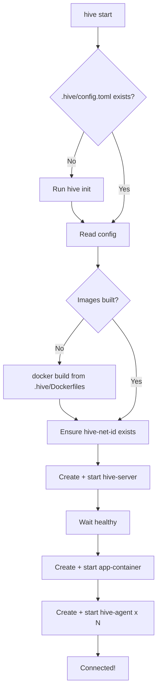
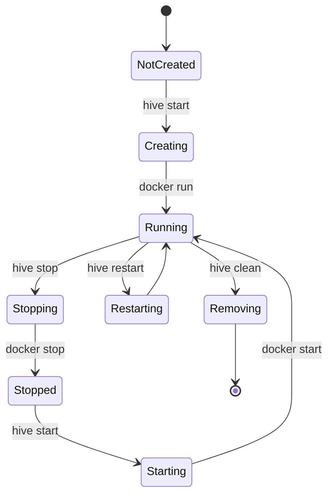
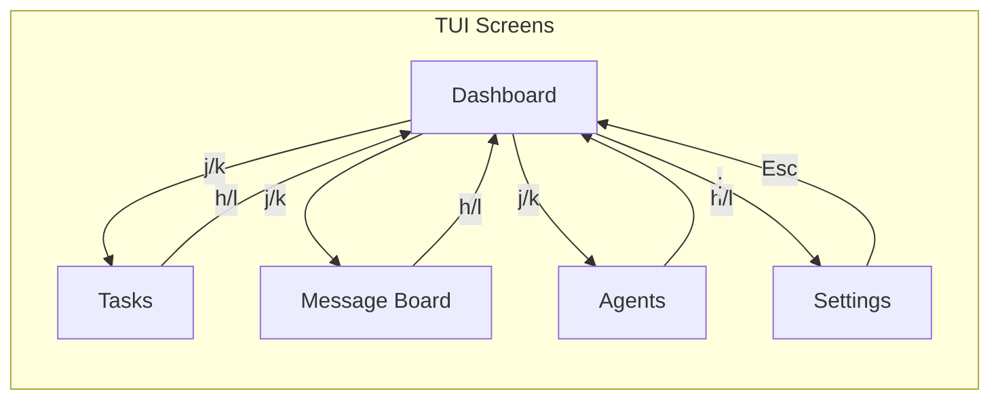

# hive-cli Specification

## Overview

`hive-cli` is the user-facing CLI and TUI application. It manages Docker containers and provides an interface for interacting with the swarm.

## Binary Name

- **Installed binary**: `hive`
- **Crate/directory**: `hive-cli`

## CLI Interface

```
hive [--version] [--help] <command> [options]
```

### Commands

| Command | Alias | Description |
|---------|-------|-------------|
| `init`  | | Initialize hive in the current project (write Dockerfiles + config to `.hive/`) |
| `start` | `up` | Build images if needed, then start all containers |
| `stop` | `down` | Stop all containers |
| `restart` | | Restart all containers |
| `rebuild` | | Rebuild Docker images from `.hive/Dockerfiles` |
| `ui` | `tui` | Start the TUI (connects to hive-server) |
| `connect` | `attach` | Alias for `ui` |
| `status` | | Show container status |
| `config` | `cfg` | Edit/open config |
| `logs` | | Show logs (all, or specific container) |
| `agent` | | Manage agents (list, spawn, kill) |
| `task` | | Task commands (list, create, show) |
| `topic` | | Message board commands |
| `completion` | | Generate shell completions |

### Global Flags

| Flag | Description |
|------|-------------|
| `-v, --verbose` | Enable verbose logging |
| `-C, --directory` | Project directory (default: current) |
| `--config` | Config file path |

## Project Layout

```
the-hive/
├── hive-cli/           # Rust crate
│   ├── src/
│   │   ├── main.rs     # Entry point, CLI args
│   │   ├── lib.rs     # Shared types
│   │   ├── commands/  # CLI command implementations
│   │   ├── tui/       # TUI application (ratatui)
│   │   ├── docker/    # Docker management (bollard)
│   │   └── config/   # Config reading/writing
│   ├── Cargo.toml
│   └── ...
└── spec/
    └── 02-hive-cli.md
```

## Initialization Flow

### `hive init`

Sets up `.hive/` in the current project directory:

1. Creates `.hive/`
2. Generates a project ID (e.g. `my-project-a3f2`)
3. Writes Dockerfiles from templates embedded in the CLI binary
4. Runs interactive config wizard
5. Writes `.hive/config.toml`
6. Appends `.hive/hive.db` to `.gitignore`

```
$ cd ~/my-project
$ hive init

Initializing Hive in /home/dan/my-project/.hive/

? How many agents? (2)
? Agent 1: kilo or claude? kilo
? Agent 1 tags? (comma separated) backend
? Agent 2: kilo or claude? claude
? Agent 2 tags? (comma separated) frontend
? Start command for dev server? npm run dev
? Test command? npm test
? Check command? npm run check

Created .hive/config.toml
Created .hive/Dockerfile.server
Created .hive/Dockerfile.agent
Created .hive/Dockerfile.app

Run 'hive start' to build images and launch the hive.
```

### `hive start`



**First-run detection:** Check for `.hive/config.toml`. If missing, run `hive init` first.

## Docker Management

`hive-cli` uses the `bollard` crate (Docker API for Rust) to manage containers.

### Container Lifecycle



### Container Setup

**hive-server:**
```bash
docker run -d \
  --name hive-server \
  --network hive-net \
  -p 8080:8080 \
  -v $(pwd)/.hive:/data \
  hive-server:latest
```

**app-container:**
```bash
docker run -d \
  --name app-container \
  --network hive-net \
  -v $(pwd):/app:Delegated \
  -v $(pwd)/.hive:/app/.hive:ro \
  -p 3000:3000 \
  app-container:latest
```

**hive-agent (per agent):**
```bash
docker run -d \
  --name hive-agent-0 \
  --network hive-net \
  -v $(pwd):/app:Delegated \
  -v $(pwd)/.hive:/app/.hive:ro \
  -e HIVE_AGENT_ID=agent-0 \
  -e HIVE_SERVER_URL=ws://hive-server:8080 \
  -e HIVE_APP_DAEMON_URL=http://app-container:8081 \
  -e CODING_AGENT=kilo \
  -e AGENT_TAGS=backend \
  hive-agent:latest
```

### Networks

Create `hive-net` bridge network on first start:
```bash
docker network create hive-net 2>/dev/null || true
```

## TUI (User Control Terminal)

Built with `ratatui`.

### Screen Navigation



### Screens

**1. Dashboard (main screen)**
- Agent status (connected, working on task, idle)
- Task queue (next 5 tasks)
- Recent messages
- Quick actions

**2. Tasks**
- List all tasks with status
- Filter by status, tag, assignee
- Create/edit task
- Set dependencies

**3. Message Board**
- List topics
- View topic + comments
- Create topic
- Blocking/non-blocking read controls

**4. Agent View**
- See what each agent is doing
- Push message to agent
- View agent logs

**5. Settings**
- Edit config
- View/manage API keys
- Container management

### Keybindings (vim-style)

| Key | Action |
|-----|--------|
| `Esc` | Back / Cancel |
| `q` | Quit |
| `j/k` | Down/up |
| `h/l` | Left/right (nav) |
| `Enter` | Select |
| `:` | Command palette |
| `g` | Go top |
| `G` | Go bottom |
| `Ctrl+r` | Refresh |
| `Ctrl+c` | Interrupt agent |

## Configuration Management

### Config File Location

- Default: `.hive/config.toml` (relative to project root)
- Override: `--config /path/to/config.toml`

### Config Schema

```toml
# .hive/config.toml

[server]
host = "hive-server"
port = 8080

[agents]
count = 2
default_tags = []

[agent.0]
coding_agent = "kilo"
tags = ["backend"]

[agent.1]
coding_agent = "claude" 
tags = ["frontend"]

[app]
start_command = "npm run dev"
test_command = "npm test"
check_command = "npm run check"
restart_command = "npm run restart"
dev_port = 3000

[tools]
parallel = ["test", "check"]
queued = ["start", "restart", "stop", "logs"]

[logging]
level = "info"
```

### Database

SQLite at `.hive/hive.db`. Created by hive-server on first start.

## API Keys

Passed via environment to containers:
- `ANTHROPIC_API_KEY` → hive-agent (for Claude Code)
- `OPENAI_API_KEY` → hive-agent (if using OpenAI models with Kilo)
- `KILO_API_KEY` → hive-agent (if using Kilo's cloud)

Read from:
1. Config file (`[agent.0].api_key`)
2. Environment variables
3. `.env` file in `.hive/`

## Error Handling

- Container startup failures → Show error, offer retry
- Server unreachable → Auto-reconnect with backoff
- Agent disconnected → Mark in TUI, option to restart

## Logging

- `hive-cli` logs to stderr (or file with `--log-file`)
- Container logs accessible via `hive logs [container]`
- All containers log to stdout, collected by Docker

---

## References

### Related Sections

- [Overview](./00-overview.md) - Problem statement
- [Architecture](./01-architecture.md) - System overview
- [Docker](./05-docker.md) - Container specs
- [Configuration](./06-configuration.md) - Config format

### Deep Links

- [Docker management](./02-hive-cli.md#docker-management) - Container lifecycle
- [TUI screens](./02-hive-cli.md#tui-user-control-terminal) - Screen descriptions
- [Config schema](./06-configuration.md#schema) - Config options

### See Also

- [Glossary](./07-glossary.md) - Term definitions
- [Index](./index.md) - File index
