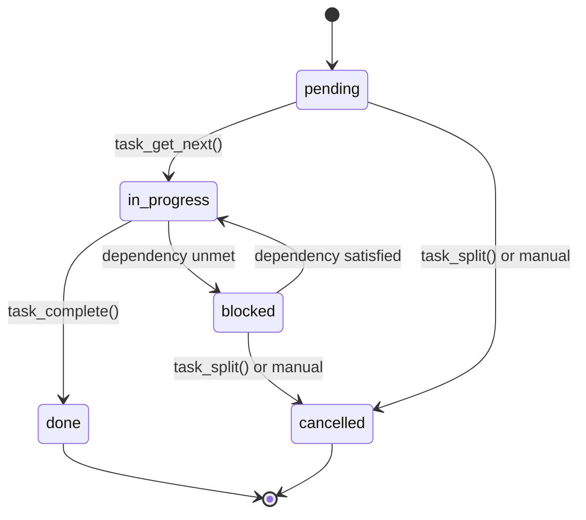
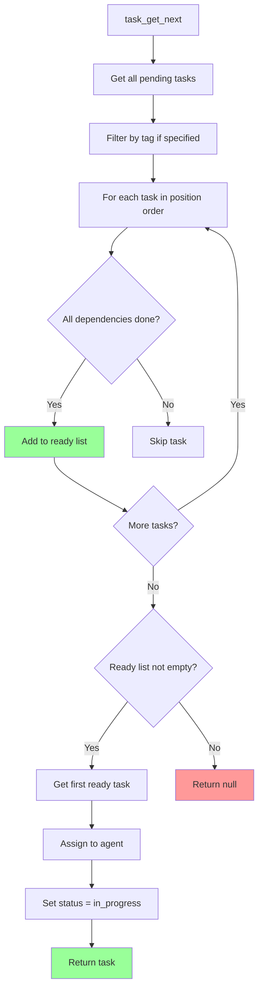
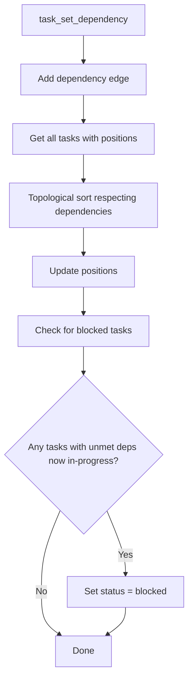

# hive-server Specification

## Overview

`hive-server` is the coordination control plane. It runs in a Docker container and handles:
- Task tracker (create, list, claim, update, complete)
- Message board (topics, comments)
- Push message routing
- Agent registry

## Binary Name

- **Crate**: `hive-server`
- **Container**: `hive-server:latest`

## API

All communication via WebSocket (preferred) or TCP. JSON payloads.

### Connection

```
ws://hive-server:8080/ws?agent_id=agent-0&agent_name=agent-0
```

### Message Format

```json
{
  "type": "request|response|error|push",
  "id": "uuid",
  "method": "task_create|task_list|...",
  "params": { ... },
  "result": { ... }  // response only
}
```

## Task Tracker API

### `task_create`

Create a new task.

```json
{
  "method": "task_create",
  "params": {
    "title": "Fix login bug",
    "description": "Users cannot log in with...",
    "tags": ["backend", "urgent"]
  }
}
```

Response:
```json
{
  "result": {
    "id": "task-123",
    "title": "Fix login bug",
    "status": "pending",
    "created_at": 1699999999
  }
}
```

### `task_list`

List tasks with filters.

```json
{
  "method": "task_list",
  "params": {
    "status": "pending",        // optional: pending|in-progress|done|blocked|cancelled
    "tag": "backend",           // optional: filter by tag
    "assigned_agent_id": "agent-0"  // optional: filter by assignee
  }
}
```

Response:
```json
{
  "result": {
    "tasks": [
      {
        "id": "task-123",
        "title": "Fix login bug",
        "status": "pending",
        "tags": ["backend", "urgent"],
        "assigned_agent_id": null,
        "created_at": 1699999999,
        "updated_at": 1699999999,
        "position": 0
      }
    ]
  }
}
```

### `task_get`

Get single task details.

```json
{
  "method": "task_get",
  "params": { "id": "task-123" }
}
```

### `task_update`

Update task fields (description, tags, status).

```json
{
  "method": "task_update",
  "params": {
    "id": "task-123",
    "description": "New description",  // optional
    "tags": ["backend"],                 // optional
    "status": "blocked"                  // optional
  }
}
```

### `task_complete`

Mark task as done and get the next available task.

```json
{
  "method": "task_complete",
  "params": {
    "id": "task-123",
    "result": "Fixed the login bug by..."  // optional summary
  }
}
```

Response:
```json
{
  "result": {
    "completed": "task-123",
    "next_task": {
      // Next task object, or null if none available
      "id": "task-456",
      "title": "Add tests",
      "description": "...",
      "tags": ["backend"],
      "status": "pending"
    }
  }
}
```

**Behavior:**
1. Mark `task-123` as `done`
2. Find next available task (dependencies satisfied, not assigned)
3. If found, assign to calling agent, return task
4. If none, return `next_task: null`

### `task_get_next`

Get next available task (without completing current).

```json
{
  "method": "task_get_next",
  "params": {
    "tag": "backend"  // optional filter
  }
}
```

Response:
```json
{
  "result": {
    "task": {
      "id": "task-456",
      "title": "Add tests",
      "status": "in-progress",
      "assigned_agent_id": "agent-0"
    }
  }
}
```

### `task_split`

Split a task into ordered subtasks.

```json
{
  "method": "task_split",
  "params": {
    "id": "task-123",
    "subtasks": ["Write unit tests", "Write integration tests"]
  }
}
```

Response:
```json
{
  "result": {
    "original_status": "cancelled",
    "subtasks": [
      { "id": "task-456", "title": "Write unit tests", "position": 1 },
      { "id": "task-457", "title": "Write integration tests", "position": 2 }
    ]
  }
}
```

### `task_set_dependency`

Set task dependency.

```json
{
  "method": "task_set_dependency",
  "params": {
    "task_id": "task-B",
    "depends_on_id": "task-C"
  }
}
```

**Ordering:** After setting, tasks are re-sorted topologically. Tasks with unmet dependencies move after their dependencies.

## Message Board API

### `topic_create`

Create a topic.

```json
{
  "method": "topic_create",
  "params": {
    "title": "API design for auth",
    "content": "We need to design the auth API..."
  }
}
```

### `topic_list`

List topics.

```json
{
  "method": "topic_list",
  "params": {
    "since": 1699999999  // optional: only topics updated after timestamp
  }
}
```

Response:
```json
{
  "result": {
    "topics": [
      {
        "id": "topic-123",
        "title": "API design for auth",
        "creator_agent_id": "agent-0",
        "created_at": 1699999999,
        "last_updated_at": 1700000000,
        "comment_count": 3
      }
    ]
  }
}
```

### `topic_get`

Get topic with comments.

```json
{
  "method": "topic_get",
  "params": {
    "id": "topic-123",
    "since": 1699999900  // optional: only comments after timestamp
  }
}
```

### `topic_comment`

Add comment to topic.

```json
{
  "method": "topic_comment",
  "params": {
    "topic_id": "topic-123",
    "content": "I think we should use JWT..."
  }
}
```

### `topic_wait`

Blocking read - wait for new content.

```json
{
  "method": "topic_wait",
  "params": {
    "topic_id": "topic-123",
    "timeout_seconds": 30
  }
}
```

Response (when new content arrives):
```json
{
  "result": {
    "topic": { ... },
    "comments": [ ... ]  // new comments only
  }
}
```

Response (on timeout):
```json
{
  "result": {
    "topic": null,
    "comments": []
  }
}
```

### `topic_list_new`

Non-blocking - list topics with new content since last read.

```json
{
  "method": "topic_list_new",
  "params": {
    "since": 1699999999
  }
}
```

## Push Message API

### `push_send`

Send push message to agent.

```json
{
  "method": "push_send",
  "params": {
    "to_agent_id": "agent-1",
    "content": "Hey, check the message board topic about auth API"
  }
}
```

### `push_list`

List undelivered push messages.

```json
{
  "method": "push_list",
  "params": {}
}
```

Response:
```json
{
  "result": {
    "messages": [
      {
        "id": "msg-123",
        "from_agent_id": "agent-0",
        "content": "Hey, check the topic...",
        "created_at": 1699999999
      }
    ]
  }
}
```

### `push_ack`

Acknowledge message received (marks as delivered).

```json
{
  "method": "push_ack",
  "params": {
    "message_ids": ["msg-123"]
  }
}
```

## Agent API

### `agent_register`

Called on connect.

```json
{
  "method": "agent_register",
  "params": {
    "name": "agent-0",
    "tags": ["backend", "rust"]
  }
}
```

### `agent_list`

List connected agents.

```json
{
  "method": "agent_list",
  "params": {}
}
```

## Task Status State Machine



## Get Next Task Algorithm



## Topological Sort on Dependency Change



## Database Schema

```sql
CREATE TABLE tasks (
    id TEXT PRIMARY KEY,
    title TEXT NOT NULL,
    description TEXT,
    status TEXT CHECK(status IN ('pending','in-progress','done','blocked','cancelled')) DEFAULT 'pending',
    assigned_agent_id TEXT,
    tags TEXT, -- JSON array
    result TEXT, -- completion result/summary
    created_at INTEGER NOT NULL,
    updated_at INTEGER NOT NULL,
    position INTEGER NOT NULL
);

CREATE TABLE task_dependencies (
    task_id TEXT REFERENCES tasks(id) ON DELETE CASCADE,
    depends_on_id TEXT REFERENCES tasks(id) ON DELETE CASCADE,
    PRIMARY KEY (task_id, depends_on_id)
);

CREATE TABLE topics (
    id TEXT PRIMARY KEY,
    title TEXT NOT NULL,
    content TEXT NOT NULL,
    creator_agent_id TEXT,
    created_at INTEGER NOT NULL,
    last_updated_at INTEGER NOT NULL
);

CREATE TABLE comments (
    id TEXT PRIMARY KEY,
    topic_id TEXT REFERENCES topics(id) ON DELETE CASCADE,
    content TEXT NOT NULL,
    creator_agent_id TEXT,
    created_at INTEGER NOT NULL
);

CREATE TABLE push_messages (
    id TEXT PRIMARY KEY,
    from_agent_id TEXT,
    to_agent_id TEXT NOT NULL,
    content TEXT NOT NULL,
    delivered BOOLEAN DEFAULT FALSE,
    created_at INTEGER NOT NULL
);

CREATE TABLE agents (
    id TEXT PRIMARY KEY,
    name TEXT NOT NULL,
    tags TEXT, -- JSON array
    connected_at INTEGER,
    last_seen_at INTEGER
);

CREATE INDEX idx_tasks_status ON tasks(status);
CREATE INDEX idx_tasks_position ON tasks(position);
CREATE INDEX idx_comments_topic ON comments(topic_id);
CREATE INDEX idx_push_to_agent ON push_messages(to_agent_id, delivered);
```

## Configuration (Environment)

```bash
# Server
HIVE_SERVER_PORT=8080
HIVE_DB_PATH=/data/hive.db

# Logging
RUST_LOG=info
```

---

## References

### Related Sections

- [Overview](./00-overview.md) - Problem statement
- [Architecture](./01-architecture.md) - System overview
- [hive-agent](./04-hive-agent.md) - How agents use the API
- [Configuration](./06-configuration.md) - Server config

### Deep Links

- [Task API](./03-hive-server.md#task-tracker-api) - All task operations
- [task_get_next](./03-hive-server.md#task_get_next) - Algorithm for claiming tasks
- [topic_wait](./03-hive-server.md#topic_wait) - Blocking reads
- [Push messages](./03-hive-server.md#push-message-api) - Direct messaging
- [Database schema](./03-hive-server.md#database-schema) - SQLite tables

### See Also

- [Glossary](./07-glossary.md) - Term definitions
- [Index](./index.md) - File index
