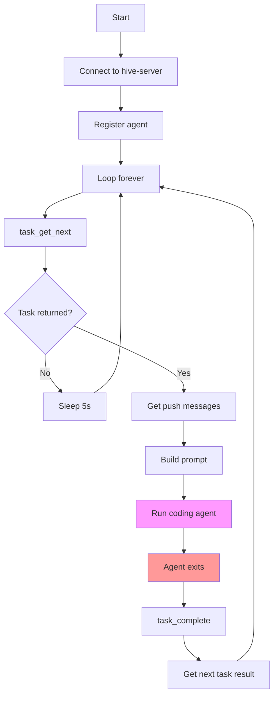
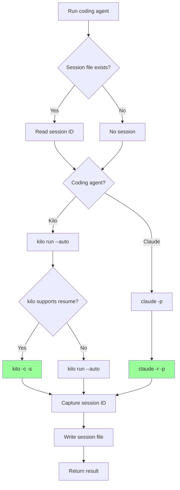
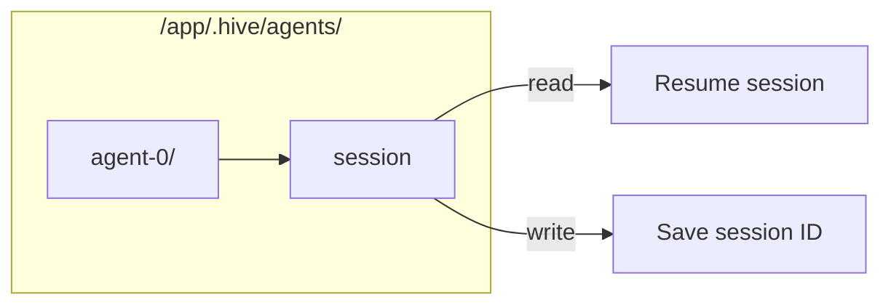
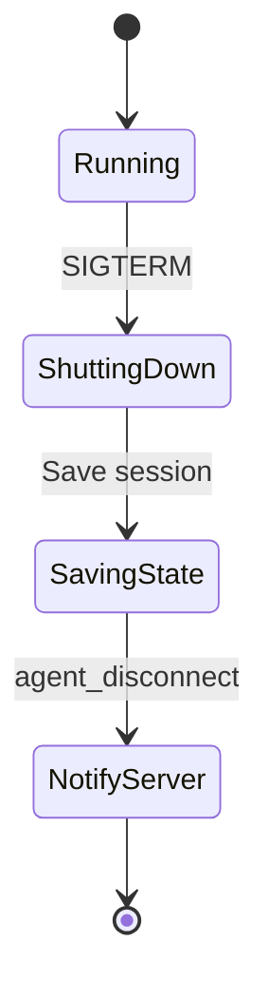

# hive-agent Specification

## Overview

`hive-agent` is the agent executor. It runs in Docker containers (one per agent) and:
- Executes coding agents (Kilo, Claude Code) as subprocesses
- Runs an MCP server exposing coordination tools
- Manages session resumption for continuity within tasks

## Binary Name

- **Crate**: `hive-agent`
- **Container**: `hive-agent:latest`

## Environment Variables

```bash
# Required
HIVE_AGENT_ID=agent-0
HIVE_SERVER_URL=ws://hive-server:8080
HIVE_APP_DAEMON_URL=http://app-container:8081

# Coding agent
CODING_AGENT=kilo  # or claude
AGENT_TAGS=backend,rust

# API keys (for coding agent)
ANTHROPIC_API_KEY=sk-...
OPENAI_API_KEY=sk-...
```

## MCP Tools (max 10)

### Task Tools

| Tool | Description |
|------|-------------|
| `task_complete` | Complete current task, get next task |
| `task_get_next` | Get next available task (optional tag filter) |

### Message Board Tools

| Tool | Description |
|------|-------------|
| `topic_create` | Create a new topic |
| `topic_list` | List topics (optionally since timestamp) |
| `topic_get` | Get topic + comments (optionally since timestamp) |
| `topic_comment` | Add comment to topic |
| `topic_wait` | Blocking wait for new content (timeout) |

### Push Tools

| Tool | Description |
|------|-------------|
| `push_send` | Send message to another agent |
| `push_get` | Get undelivered push messages |

### App Tools

| Tool | Description |
|------|-------------|
| `app_exec` | Execute app commands (test, check, start, restart, stop, logs) |

That's **9 tools total**.

## Main Agent Loop



## Execution Flow

### Main Loop

```
1. Connect to hive-server (WebSocket)
2. Register as agent (name, tags)
3. Loop:
   a. Call task_get_next (with agent's tags)
   b. If no task: sleep and retry, or exit if told to stop
   c. If task:
      i.   Get any pending push messages
      ii.  Build prompt: task description + push messages
      iii. Run coding agent (single-turn, or resume if session exists)
      iv.  On agent exit: call task_complete with result
```

### Session Resumption



### State File Management



```python
# State file: /app/.hive/agents/{agent_id}/session
session_file = "/app/.hive/agents/{agent_id}/session"

def run_coding_agent(task: Task, push_messages: list, resume_session: bool):
    prompt = build_prompt(task, push_messages)
    
    if coding_agent == "kilo":
        cmd = ["kilo", "run", "--auto"]
        if resume_session and session_file.exists():
            session_id = read(session_file)
            cmd.extend(["-c", "-s", session_id])
        cmd.append(prompt)
    else:  # claude
        cmd = ["claude", "-p", prompt]
        if resume_session and session_file.exists():
            session_id = read(session_file)
            cmd = ["claude", "-r", session_id, "-p", prompt]
    
    result = subprocess.run(cmd, ...)
    
    # Extract and save session ID for resume
    if session_id := extract_session_id(result.stdout):
        write(session_file, session_id)
    
    return result
```

### Push Message Delivery

```python
# On each coding agent run, check for new push messages
def get_push_messages():
    messages = mcp.call("push_get")
    # Prepend to prompt as: "[agent-1]: message content"
    return format_push_messages(messages)
```

```mermaid
flowchart TD
    A[Get push messages] --> B[Call push_get MCP]
    B --> C{Messages?}
    
    C -->|Yes| D[Format as [agent]: message]
    C -->|No| E[Empty]
    
    D --> F[Prepend to prompt]
    E --> F
    
    F --> G[Run coding agent]
```

## MCP Server

Using `rmcp` crate.

### Server Setup

```rust
// MCP server on localhost:7890 (or Unix socket)
let server = McpServer::new()
    .tool("task_complete", task_complete_handler)
    .tool("task_get_next", task_get_next_handler)
    .tool("topic_create", topic_create_handler)
    .tool("topic_list", topic_list_handler)
    .tool("topic_get", topic_get_handler)
    .tool("topic_comment", topic_comment_handler)
    .tool("topic_wait", topic_wait_handler)
    .tool("push_send", push_send_handler)
    .tool("push_get", push_get_handler)
    .tool("app_exec", app_exec_handler)
    .run();
```

### Tool Implementations

#### `task_complete`

```rust
async fn task_complete(
    id: String,
    result: Option<String>,
) -> Result<CompleteResponse, Error> {
    // Call hive-server: task_complete
    // Returns: { completed: "...", next_task: {...} | null }
    server.call("task_complete", json!({ "id": id, "result": result })).await
}
```

#### `app_exec`

```rust
async fn app_exec(
    command: String,          // "start" | "stop" | "restart" | "test" | "check" | "logs"
    test_pattern: Option<String>,
) -> Result<AppExecResponse, Error> {
    let url = format!("{}/exec", env::var("HIVE_APP_DAEMON_URL")?;
    
    let body = json!({
        "command": command,
        "pattern": test_pattern
    });
    
    let response = reqwest::Client::new()
        .post(&url)
        .json(&body)
        .send()
        .await?;
    
    Ok(response.json().await?)
}
```

## Coding Agent Configuration

### Kilo

```bash
# In container, Kilo config at ~/.config/kilo/opencode.json
{
  "permission": {
    "*": "allow"  // Autonomous mode - allow all
  }
}
```

### Claude Code

```bash
# Run with --dangerously-skip-permissions for autonomous operation
# Or configure permissions in ~/.claude/settings.json
```

## State Files

```
/app/.hive/
├── agents/
│   └── {agent_id}/
│       └── session          # Current session ID for resume
└── (other project files)
```

## Error Handling

- **Server disconnect**: Reconnect with exponential backoff
- **Coding agent crash**: Log error, notify server, exit with error
- **MCP tool error**: Return error to coding agent (it can decide how to handle)

## Shutdown Flow



On SIGTERM:
1. Save any pending session state
2. Notify server (agent disconnecting)
3. Exit gracefully

---

## References

### Related Sections

- [Overview](./00-overview.md) - Problem statement
- [Architecture](./01-architecture.md) - System overview
- [hive-server](./03-hive-server.md) - Server API
- [Docker](./05-docker.md) - Container setup
- [Configuration](./06-configuration.md) - Agent config

### Deep Links

- [MCP tools](./04-hive-agent.md#mcp-tools-max-10) - All available tools
- [Main loop](./04-hive-agent.md#main-agent-loop) - Agent execution flow
- [Session resumption](./04-hive-agent.md#session-resumption) - How continuity works
- [app_exec](./04-hive-agent.md#app_exec) - Executing dev commands
- [Coding agent commands](./01-architecture.md#execution-model-single-turn-with-session-resumption) - Kilo/Claude CLI

### See Also

- [Glossary](./07-glossary.md) - Term definitions
- [Index](./index.md) - File index
