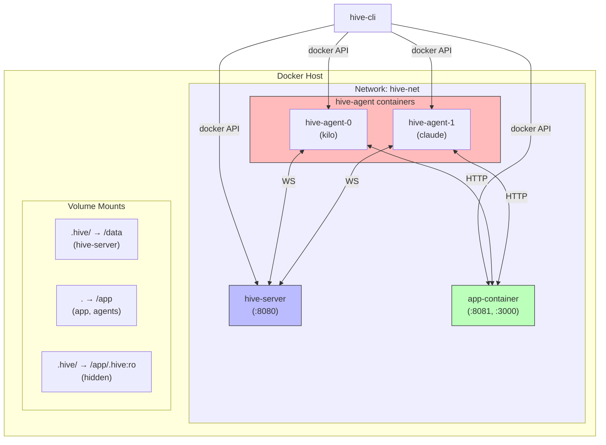
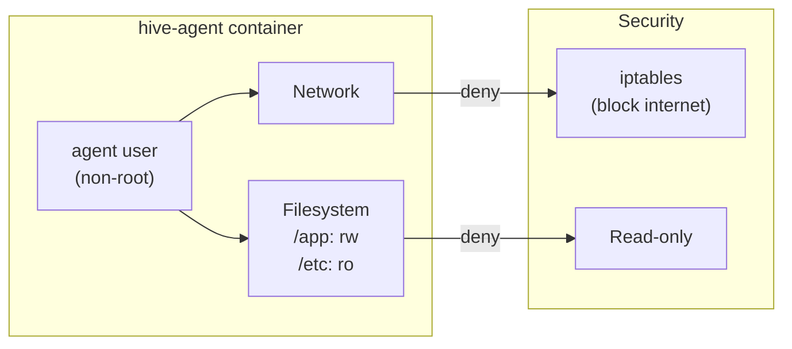
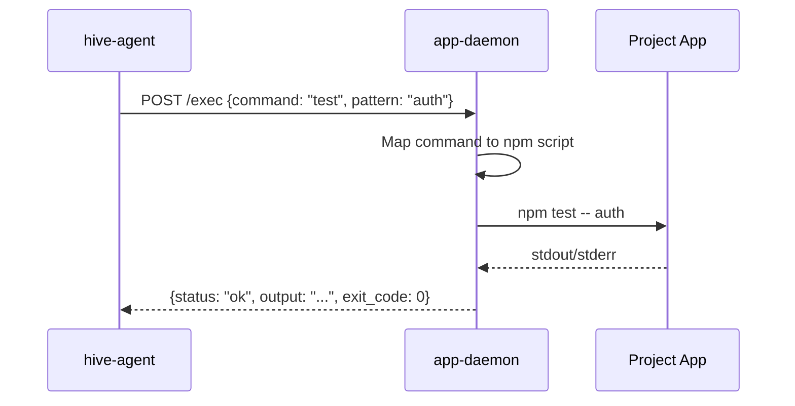
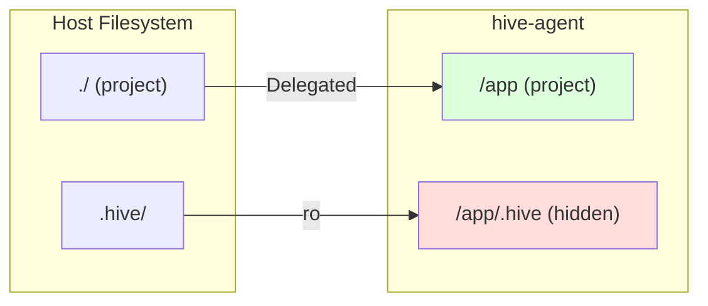
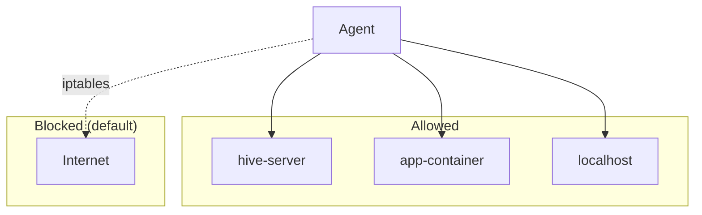

# Docker Specification

## Overview

Three container types:
1. `hive-server` - Control plane
2. `hive-agent` - Agent executor (N instances)
3. `app-container` - Shared dev environment with app-daemon

## Deployment Diagram



## Networks

**Bridge network: `hive-net`**

```bash
docker network create hive-net 2>/dev/null || true
```

## Container: hive-server

### Dockerfile

```dockerfile
FROM rust:1.75-slim AS builder

WORKDIR /build
COPY hive-server/ ./
RUN cargo build --release

FROM debian:bookworm-slim
RUN apt-get update && apt-get install -y ca-certificates && rm -rf /var/lib/apt/lists/*
COPY --from=builder /build/target/release/hive-server /usr/local/bin/
RUN useradd -m -u 1000 hive
USER hive
WORKDIR /data
CMD ["hive-server"]
```

### Run Command

```bash
docker run -d \
  --name hive-server \
  --network hive-net \
  -p 8080:8080 \
  -v $(pwd)/.hive:/data \
  -e RUST_LOG=info \
  hive-server:latest
```

### Ports

| Port | Protocol | Description |
|------|----------|-------------|
| 8080 | WS/TCP   | Agent connections, API |

## Container: hive-agent

### Dockerfile

```dockerfile
FROM debian:bookworm-slim

# Install base tools
RUN apt-get update && apt-get install -y \
    curl \
    git \
    findutils \
    grep \
    sed \
    awk \
    jq \
    fzf \
    httpie \
    && rm -rf /var/lib/apt/lists/*

# Install Node.js
RUN curl -fsSL https://deb.nodesource.com/setup_20.x | bash - \
    && apt-get install -y nodejs \
    && npm install -g pnpm \
    && rm -rf /var/lib/apt/lists/*

# Install Rust
RUN curl --proto '=https' --tlsv1.2 -sSf https://sh.rustup.rs | sh -s -- -y
ENV PATH="/root/.cargo/bin:${PATH}"

# Install Kilo
RUN npm install -g @kilocode/cli

# Install Claude Code
RUN curl -fsSL https://claude.ai/install.sh | sh

# Copy hive-agent binary
COPY hive-agent/target/release/hive-agent /usr/local/bin/

# Create user (non-root for safety)
RUN useradd -m -u 1000 agent
USER agent

WORKDIR /app
CMD ["hive-agent"]
```

### Run Command

```bash
docker run -d \
  --name hive-agent-0 \
  --network hive-net \
  -v $(pwd):/app:Delegated \
  -v $(pwd)/.hive:/app/.hive:ro \
  -e HIVE_AGENT_ID=agent-0 \
  -e HIVE_SERVER_URL=ws://hive-server:8080 \
  -e HIVE_APP_DAEMON_URL=http://app-container:8081 \
  -e CODING_AGENT=kilo \
  -e AGENT_TAGS=backend \
  -e ANTHROPIC_API_KEY \
  hive-agent:latest
```

### Security



- **User**: Runs as non-root `agent` user
- **Filesystem**: Only `/app` is writable
- **Network**: Can reach hive-server, app-container, localhost
- **iptables**: Drop all other outbound (optional, advanced)

## Container: app-container

### Dockerfile

```dockerfile
FROM debian:bookworm-slim

# Install base tools
RUN apt-get update && apt-get install -y \
    curl \
    git \
    build-essential \
    && rm -rf /var/lib/apt/lists/*

# Install Node.js
RUN curl -fsSL https://deb.nodesource.com/setup_20.x | bash - \
    && apt-get install -y nodejs \
    && npm install -g pnpm bun \
    && rm -rf /var/lib/apt/lists/*

# Install Rust
RUN curl --proto '=https' --tlsv1.2 -sSf https://sh.rustup.rs | sh -s -- -y
ENV PATH="/root/.cargo/bin:${PATH}"

# Install Python + pytest
RUN apt-get update && apt-get install -y python3 python3-pip \
    && pip3 install pytest \
    && rm -rf /var/lib/apt/lists/*

# Install Go (for Go projects)
RUN apt-get update && apt-get install -y golang-go \
    && rm -rf /var/lib/apt/lists/*

# Copy app-daemon binary
COPY app-daemon/target/release/app-daemon /usr/local/bin/

# Expose ports
EXPOSE 8081 3000

WORKDIR /app
CMD ["app-daemon"]
```

### Run Command

```bash
docker run -d \
  --name app-container \
  --network hive-net \
  -v $(pwd):/app:Delegated \
  -v $(pwd)/.hive:/app/.hive:ro \
  -p 3000:3000 \
  app-container:latest
```

## app-daemon

A simple HTTP server running in `app-container`.

### API Flow



### API

```
POST /exec
Content-Type: application/json

{
  "command": "start|stop|restart|test|check|logs",
  "pattern": "optional test filter"
}
```

### Responses

```json
// Success
{
  "status": "ok",
  "output": "test output...",
  "exit_code": 0
}

// Error
{
  "status": "error",
  "error": "command failed",
  "exit_code": 1
}
```

### Implementation

```rust
// Simple Axum or Actix server on localhost:8081
async fn exec_handler(Json(payload): Json<ExecRequest>) -> Json<ExecResponse> {
    let cmd = match payload.command.as_str() {
        "start" => "npm run dev",
        "stop" => "npm run stop",   // or pkill
        "restart" => "npm run restart",
        "test" => match payload.pattern {
            Some(p) => format!("npm test -- {p}"),
            None => "npm test",
        },
        "check" => "npm run check",  // lint + types
        "logs" => "npm run logs",     // or docker logs
        _ => return Json(ExecResponse::error("unknown command")),
    };
    
    let output = Command::new("sh")
        .arg("-c")
        .arg(cmd)
        .output();
    
    // ...
}
```

## Volume Mounts

| Container | Host Path | Container Path | Options |
|-----------|-----------|----------------|---------|
| hive-server | `.hive/` | `/data` | rw |
| app-container | `.` | `/app` | Delegated |
| app-container | `.hive/` | `/app/.hive` | ro (overlay hide) |
| hive-agent | `.` | `/app` | Delegated |
| hive-agent | `.hive/` | `/app/.hive` | ro (overlay hide) |



**Key insight**: Mounting `.hive/` as `ro` inside agent/app containers hides it from the agents while keeping it accessible to hive-cli on the host.

## Build Commands

```bash
# Build all
docker build -t hive-server:latest -f Dockerfile.hive-server ./hive-server
docker build -t hive-agent:latest -f Dockerfile.hive-agent ./hive-agent
docker build -t app-container:latest -f Dockerfile.app-container ./app-container

# Or use docker-compose
docker-compose build
docker-compose up -d
```

## Docker Compose (Optional)

```yaml
# docker-compose.yml
version: '3.8'

services:
  hive-server:
    build: ./hive-server
    ports:
      - "8080:8080"
    volumes:
      - ./.hive:/data
    networks:
      - hive-net

  app-container:
    build: ./app-container
    ports:
      - "3000:3000"
    volumes:
      - .:/app:Delegated
      - ./.hive:/app/.hive:ro
    networks:
      - hive-net

  hive-agent-0:
    build: ./hive-agent
    volumes:
      - .:/app:Delegated
      - ./.hive:/app/.hive:ro
    environment:
      - HIVE_AGENT_ID=agent-0
      - HIVE_SERVER_URL=ws://hive-server:8080
      - HIVE_APP_DAEMON_URL=http://app-container:8081
      - CODING_AGENT=kilo
      - AGENT_TAGS=backend
    networks:
      - hive-net

networks:
  hive-net:
    driver: bridge
```

**Note**: We may not use docker-compose long-term since hive-cli manages containers directly, but it's useful for development/testing.

## Security Considerations

### Filesystem Isolation

```bash
# Additional restrictions (optional)
--read-only=true  # Make container filesystem read-only
# Then mount /app as tmpfs with write access
--tmpfs /app:rw,exec
```

### Network Isolation



```bash
# Block outbound except specific targets
# (Requires Docker with iptables integration)
```

### Resource Limits

```bash
# Limit memory and CPU
--memory=2g
--cpus=2
```

---

## References

### Related Sections

- [Overview](./00-overview.md) - Problem statement
- [Architecture](./01-architecture.md) - System overview
- [hive-cli](./02-hive-cli.md) - Container management
- [Configuration](./06-configuration.md) - Config format

### Deep Links

- [Container specs](./05-docker.md#container-hive-server) - hive-server container
- [hive-agent container](./05-docker.md#container-hive-agent) - Agent container setup
- [app-container](./05-docker.md#container-app-container) - Shared dev environment
- [app-daemon API](./05-docker.md#app-daemon) - HTTP API for dev commands
- [Volume mounts](./05-docker.md#volume-mounts) - How directories are mapped

### See Also

- [Glossary](./07-glossary.md) - Term definitions
- [Index](./index.md) - File index
