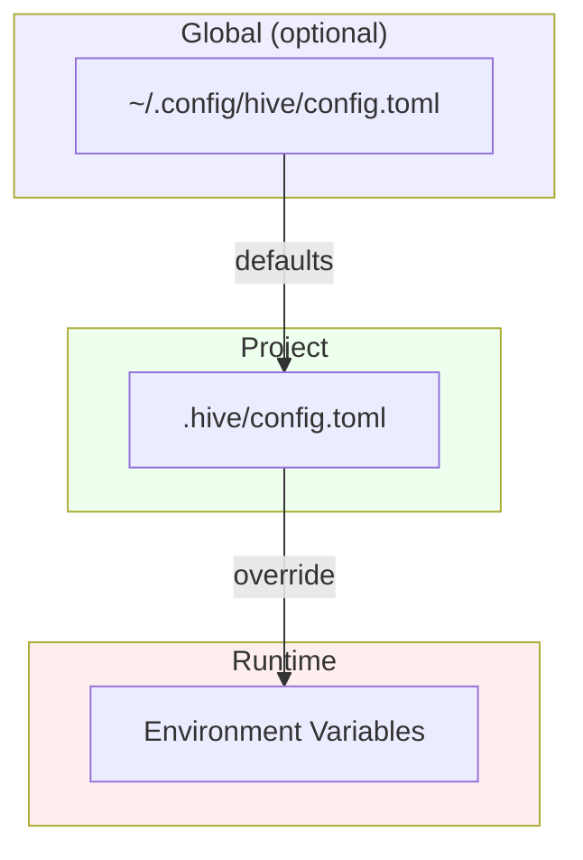
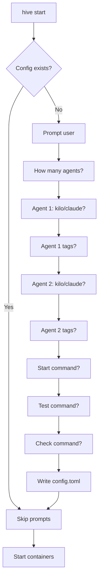
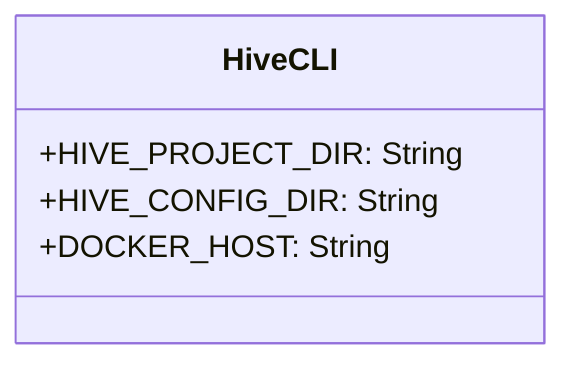
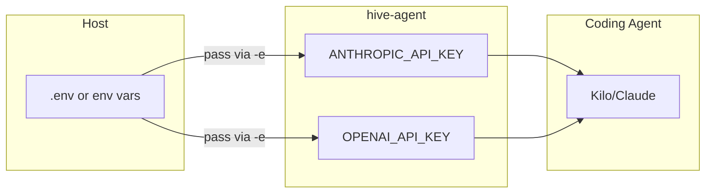
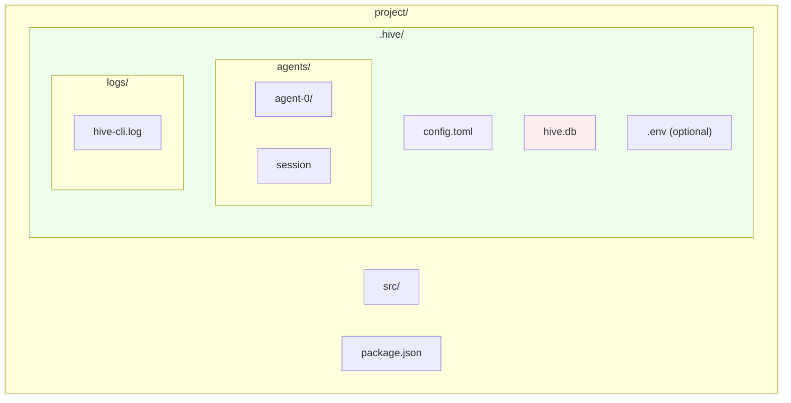
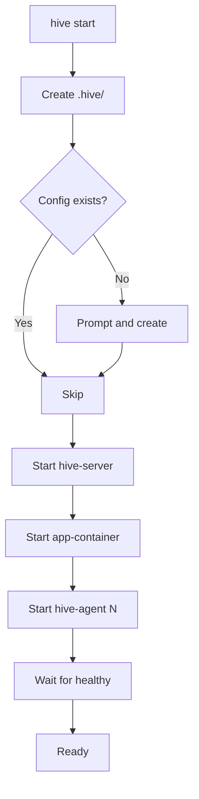
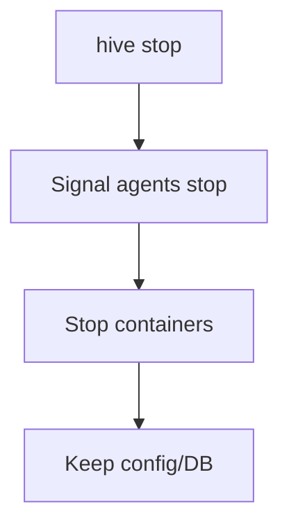
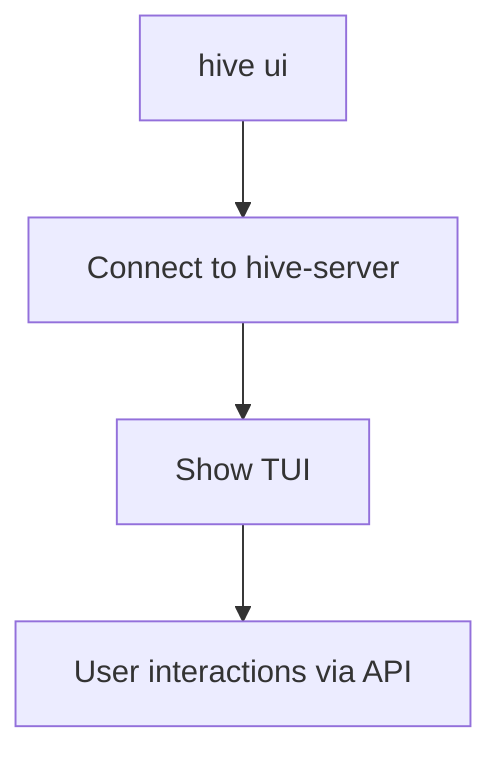
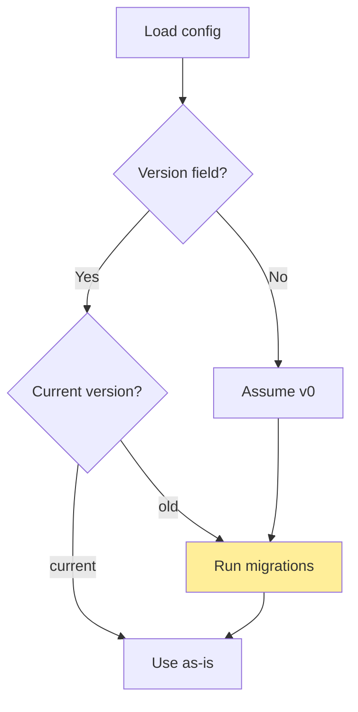

# Configuration Specification

## Overview

Configuration for The Hive spans multiple layers:
1. Project-level config (`.hive/config.toml`)
2. Agent configuration (per-agent settings)
3. Environment variables (API keys, runtime)
4. Agent coding preferences (Kilo/Claude config)

## Config Hierarchy



## Project Config: `.hive/config.toml`

Created on first `hive start` in a project directory.

### Schema

```toml
# .hive/config.toml

[server]
host = "hive-server"  # Container name in Docker network
port = 8080

[[agents]]
name = "kilo-1"
coding_agent = "kilo"
tags = ["backend"]

[[agents]]
name = "claude-1"
coding_agent = "claude"
tags = ["frontend"]

[app]
# Commands (all required)
start_command = "npm run dev"
test_command = "npm test"
check_command = "npm run lint && npm run typecheck"
restart_command = "npm run restart"
stop_command = "npm run stop"
logs_command = "npm run logs"

# Dev server port (for health checks)
dev_port = 3000
dev_url = "http://localhost:3000"

[tools]
# Which tools can run in parallel
parallel = ["test", "check"]
# Which tools must be queued (only one running at a time)
queued = ["start", "restart", "stop", "logs"]

[logging]
# CLI log level
level = "info"
# Log file (optional)
# file = ".hive/logs/hive.log"
```

### Default Values

```toml
[server]
host = "hive-server"
port = 8080

[[agents]]
name = "kilo-1"
coding_agent = "kilo"
tags = []

[app]
dev_port = 3000

[tools]
parallel = ["test", "check"]
queued = ["start", "restart", "stop", "logs"]

[logging]
level = "info"
```

### Generation Prompt Flow



When running `hive start` in a new project directory:

```
$ hive start
Initializing Hive in .hive/
? How many agents? (1)
? Agent 1: kilo or claude? [kilo/claude]
? Agent 1 tags? (comma separated)
? Start command for dev server? (npm run dev)
? Test command? (npm test)
? Check command? (npm run check)

Created .hive/config.toml
Starting containers...
```

## Environment Variables

### For hive-cli



```bash
# Project directory (defaults to current)
HIVE_PROJECT_DIR=/path/to/project

# Config directory (defaults to .hive in project)
HIVE_CONFIG_DIR=/path/to/.hive

# Docker socket (for bollard)
DOCKER_HOST=unix:///var/run/docker.sock
```

### For hive-server

```bash
# Port
HIVE_SERVER_PORT=8080

# Database path (inside container)
HIVE_DB_PATH=/data/hive.db

# Logging
RUST_LOG=info
```

### For hive-agent

```bash
# Required
HIVE_AGENT_ID=agent-0
HIVE_SERVER_URL=ws://hive-server:8080
HIVE_APP_DAEMON_URL=http://app-container:8081

# Coding agent
CODING_AGENT=kilo  # or claude
AGENT_TAGS=backend,rust

# Optional: session resume
HIVE_RESUME_SESSIONS=true
```

### API Keys

Passed to agent containers from host environment:



```bash
# For Claude Code
ANTHROPIC_API_KEY=sk-ant-...

# For Kilo (various providers)
OPENAI_API_KEY=sk-...
ANTHROPIC_API_KEY=...
GOOGLE_API_KEY=...
```

**How it works:**
1. hive-cli reads from `.env` in `.hive/` or host environment
2. Passes via `-e` to docker run commands

## Authentication Guide

Agent containers run in Docker and **cannot access the host's global auth state** (e.g. `~/.claude.json`). You must explicitly provision credentials using one of the methods below.

### Option 1: API Key (simplest, works for all providers)

Add your API key to `.hive/.env`:

```bash
hive auth set-key ANTHROPIC_API_KEY sk-ant-...
hive auth set-key OPENAI_API_KEY sk-...
hive auth set-key GOOGLE_API_KEY AI...
```

Or edit `.hive/.env` directly:

```bash
ANTHROPIC_API_KEY=sk-ant-...
```

Keys in `.hive/.env` are injected into all agent containers as environment variables. This is the recommended approach for API key users and works for both Claude Code and Kilo.

### Option 2: Third-party / Custom Endpoint

For OpenAI-compatible providers (Together, Groq, Ollama, custom proxies), set the base URL:

```bash
hive auth set-endpoint ANTHROPIC_BASE_URL https://my-proxy.example.com
hive auth set-endpoint OPENAI_BASE_URL https://api.together.xyz/v1
hive auth set-endpoint OPENAI_BASE_URL http://localhost:11434/v1  # Ollama
```

Combine with the matching API key:

```bash
hive auth set-key OPENAI_API_KEY <together-api-key>
hive auth set-endpoint OPENAI_BASE_URL https://api.together.xyz/v1
```

### Option 3: Claude Subscription (sync from host)

If you have a Claude Max/Pro subscription and have already run `claude auth login` on the host:

```bash
hive auth sync        # copies ~/.claude.json → .hive/claude.json
hive restart          # mounts new credentials into running containers
```

`.hive/claude.json` is auto-mounted as `/home/agent/.claude.json` in all claude agent containers. Re-run `hive auth sync` when the token expires.

### Option 4: Claude Subscription (login inside container)

If you don't have Claude CLI on the host, authenticate directly inside the agent container:

```bash
hive auth login       # runs 'claude auth login' inside the first agent container
```

Follow the URL/code shown in the terminal. Credentials are saved back to `.hive/claude.json` and applied on next `hive restart`.

### Checking Auth Status

```bash
hive auth status      # shows what credentials are detected for each agent
hive auth list        # lists all keys/endpoints in .hive/.env (masked)
```

### What Gets Mounted into Agent Containers

| Source | Container path | Condition |
|--------|---------------|-----------|
| `.hive/.env` vars | env vars | always (silently skipped if missing) |
| `~/.claude/` | `/home/agent/.claude/` | if directory exists on host |
| `.hive/claude.json` | `/home/agent/.claude.json` | if file exists |
| `~/.kilocode/` | `/home/agent/.kilocode/` | if directory exists on host |

`.hive/claude.json`, `.hive/.env`, and `.hive/bin/` are all gitignored by `hive init`.

### Per-agent Environment

To set env vars for a specific agent only, use the `env` map in `config.toml`:

```toml
[[agents]]
name = "claude-1"
coding_agent = "claude"
tags = []

[agents.env]
ANTHROPIC_API_KEY = "sk-ant-..."   # overrides .hive/.env for this agent only
```

## Agent Coding Configuration

### Kilo Config

Location: `~/.config/kilo/opencode.json` (inside container)

```json
{
  "permission": {
    "*": "allow"
  },
  "model": "anthropic/claude-sonnet-4-20250514"
}
```

### Claude Code Config

Location: `~/.claude/settings.json` (inside container)

Minimal for autonomous operation:
```json
{
  "permissionMode": "allow"
}
```

Or use CLI flags:
```bash
--dangerously-skip-permissions
```

## Hive-cli Config

Global config at `~/.config/hive/config.toml` (optional):

```toml
# Default values for new projects
[defaults]
agents = 2

# Docker settings
[docker]
socket = "unix:///var/run/docker.sock"
network = "hive-net"

# Logging
[logging]
level = "debug"
file = "~/.hive/logs/cli.log"
```

## Directory Structure



```
project/
├── .hive/
│   ├── config.toml      # Project config
│   ├── hive.db          # SQLite database (created by hive-server, gitignored)
│   ├── .env             # API keys (optional, gitignored)
│   ├── claude.json      # Claude OAuth credentials (gitignored, from hive auth sync/login)
│   ├── bin/             # Pre-built binaries for containers (gitignored)
│   ├── Dockerfile.*     # Editable container definitions
│   ├── agents/          # Agent session state (gitignored)
│   │   └── agent-0/
│   │       └── session
│   └── logs/            # Log files (optional)
│       ├── hive-cli.log
│       └── ...
├── src/                 # Project code
├── package.json
└── ...
```

## State Management

### On `hive start`



1. Create `.hive/` if missing
2. If no config, prompt and create
3. Start hive-server container
4. Create app-container
5. Create N hive-agent containers
6. Wait for all to be healthy

### On `hive stop`



1. Signal agents to stop (via server)
2. Stop all containers
3. Keep config and DB (persist across restarts)

### On `hive ui`



1. Connect to hive-server
2. Show TUI
3. User interactions via server API

## Validation

Config validated on load:

```mermaid
flowchart TD
    A[Load config] --> B{Valid?}
    B -->|No| C[Show error]
    C --> D[Exit]
    B -->|Yes| E[Continue]
    
    subgraph Rules["Validation Rules"]
        R1[agents len >= 1]
        R2[agents len <= 10]
        R3[agent.coding_agent in [kilo, claude]]
        R4[app.*_command non-empty]
        R5[port 1-65535]
    end
    
    A -.-> R1
    A -.-> R2
    A -.-> R3
    A -.-> R4
    A -.-> R5
```

- `agents` list has 1-10 entries
- Each `agent.name` is non-empty
- Each `agent.coding_agent` in ["kilo", "claude"]
- All app commands non-empty strings
- Port numbers valid (1-65535)

## Migration

If config format changes, include migration logic in hive-cli:



```rust
fn migrate_config(old_version: u32, config: &mut Config) {
    match old_version {
        0 => { /* v0 -> v1 migrations */ }
        1 => { /* v1 -> v2 migrations */ }
        _ => {}
    }
}
```

---

## References

### Related Sections

- [Overview](./00-overview.md) - Problem statement
- [Architecture](./01-architecture.md) - System overview
- [hive-cli](./02-hive-cli.md) - CLI commands
- [Docker](./05-docker.md) - Container environment variables
- [Glossary](./07-glossary.md) - Config key definitions

### Deep Links

- [Config schema](./06-configuration.md#schema) - Full config options
- [Environment variables](./06-configuration.md#environment-variables) - All env vars
- [Directory structure](./06-configuration.md#directory-structure) - File layout
- [Validation rules](./06-configuration.md#validation) - Config validation

### See Also

- [Index](./index.md) - File index
